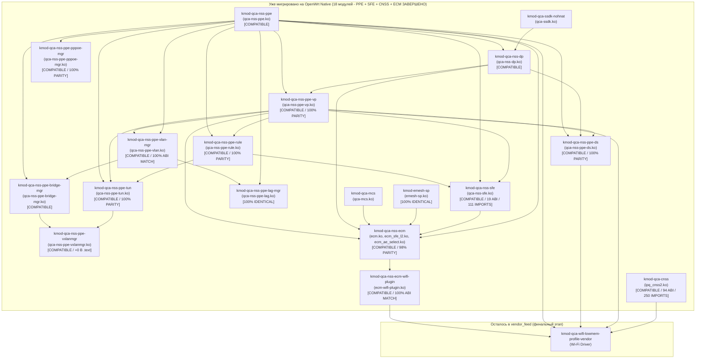

# Миграция драйверов Qualcomm (QCA) на открытые исходники в OpenWrt (RD15 / IPQ53xx)

Данный документ содержит архитектурный обзор, результаты бинарного анализа и практические особенности миграции проприетарных драйверов Qualcomm из вендорского фида (`vendor_feed`, блобы из заводской прошивки Xiaomi MiWiFi RD15 1.0.68) в нативные пакеты OpenWrt (`package/kernel/`), собираемые из открытых репозиториев **CodeLinaro (QSDK)**.

---

## 1. Методология и инструментарий валидации

Для каждого модуля производилась валидация по четырем критериям:
1. **Совместимость версий ядра и ABI (Vermagic):**  
   Для ядра Linux 5.4.213 в целевом профиле `target/linux/ipq53xx/rd15/target.mk` используется специализированный тулчейн ядра **GCC 7.5.0**:
   ```makefile
   KERNEL_TOOLCHAIN_DIR_NAME:=toolchain-arm_cortex-a7+neon-vfpv4_gcc-7.5.0_kernel
   KERNEL_CROSS:=$(KERNEL_TOOLCHAIN_DIR)/bin/arm-openwrt-linux-muslgnueabi-
   KERNEL_CC:=$(KERNEL_CROSS)gcc
   ```
   *(Пакеты пользовательского пространства userland собираются компилятором GCC 13.3.0, а ядро и все `kmod-*` — строго GCC 7.5.0 для исключения несовместимости ABI структур ядра).*
2. **Анализ экспортируемых (ABI) и импортируемых символов:**  
   Скрипт `vendor_scripts/compare_kmod.py` парсит таблицы символов ELF (`readelf` / `pyelftools`), гарантируя, что:
   * Все функции, которые стоковый модуль экспортировал для других драйверов, на 100% присутствуют и имеют идентичные имена;
   * Набор внешних символов ядра, запрашиваемых модулем, не содержит лишних или отсутствующих зависимостей.
3. **Бинарный и функциональный анализ кода (.text, функции):**  
   Сравнение размера секции исполняемого кода `.text`, дизассемблирование и подсчет количества функций.
4. **Живое тестирование на физическом устройстве (Xiaomi Router BE3600, IP 192.168.11.46):**  
   Проверка связывания модулей (`lsmod`), отсутствия ошибок в `dmesg`, корректности счетчиков в `debugfs` и работы сети.

---

## 2. Сводная таблица миграции 18 модулей

| Пакет OpenWrt | Исходный файл (.ko) | Репозиторий CodeLinaro | Коммит / Дата | Статус | Совпадение ABI / Символы |
|---|---|---|---|:---:|:---:|
| **`kmod-emesh-sp`** | `emesh-sp.ko` | `oss/lklm/emesh-sp.git` | `3de1a656` (21.07.2023) | **`[IDENTICAL]`** | **100% побайтовое совпадение** (+0 байт diff) |
| **`kmod-qca-nss-ppe`** | `qca-nss-ppe.ko` | `oss/lklm/nss-ppe.git` | `0c6434d7` (19.01.2024) | **`[COMPATIBLE]`** | **167/167 экспортов**, **232/232 импортов**, **537/537 функций** (.text diff +464 байта) |
| **`kmod-qca-mcs`** | `qca-mcs.ko` | `oss/lklm/qca-mcs.git` | `2237266b` (07.02.2024) | **`[COMPATIBLE]`** | **12/12 экспортов**, **59/59 импортов** |
| **`kmod-qca-ssdk-nohnat`** | `qca-ssdk.ko` | `oss/lklm/qca-ssdk.git` | `0ac166a1` (20.05.2024) | **`[COMPATIBLE]`** | **730 экспортов**, патч `fal_port_reset` |
| **`kmod-qca-nss-dp`** | `qca-nss-dp.ko` | `oss/lklm/nss-dp.git` | `93102877` (01.02.2024) | **`[COMPATIBLE]`** | **15/15 экспортов**, **202/202 импортов**, **182/182 функций** |
| **`kmod-qca-nss-ppe-vp`** | `qca-nss-ppe-vp.ko` | `oss/lklm/nss-ppe.git` | `0c6434d7` (19.01.2024) | **`[COMPATIBLE]`** | **8/8 экспортов**, **61/61 импортов**, **24/24 функций** |
| **`kmod-qca-nss-ppe-rule`** | `qca-nss-ppe-rule.ko` | `oss/lklm/nss-ppe.git` | `0c6434d7` (19.01.2024) | **`[COMPATIBLE]`** | **4/4 экспортов**, **30/30 импортов**, **12/12 функций** (.text diff -48 байт) |
| **`kmod-qca-nss-ppe-ds`** | `qca-nss-ppe-ds.ko` | `oss/lklm/nss-ppe.git` | `0c6434d7` (19.01.2024) | **`[COMPATIBLE]`** | **14/14 экспортов**, **29/29 импортов**, **27/27 функций** (.text diff **+0 байт**, 99.04% сходство) |
| **`kmod-qca-nss-ppe-tun`** | `qca-nss-ppe-tun.ko` | `oss/lklm/nss-ppe.git` | `0c6434d7` (19.01.2024) | **`[COMPATIBLE]`** | **17/17 экспортов**, **42/42 импортов**, **45/45 функций** (.text diff **+0 байт**, 99.85% сходство) |
| **`kmod-qca-nss-ppe-pppoe-mgr`** | `qca-nss-ppe-pppoe-mgr.ko` | `oss/lklm/nss-ppe.git` | `0c6434d7` (19.01.2024) | **`[COMPATIBLE]`** | **21/21 импортов**, **4/4 функций** (.text diff **+0 байт**, 99.95% сходство, 1 байт diff) |
| **`kmod-qca-nss-ppe-vlan-mgr`** | `qca-nss-ppe-vlan.ko` | `oss/lklm/nss-ppe.git` | `0c6434d7` (19.01.2024) | **`[COMPATIBLE]`** | **10/10 экспортов**, **50/50 импортов**, **25 функций** (.text diff -176 байт) |
| **`kmod-qca-nss-ppe-lag-mgr`** | `qca-nss-ppe-lag.ko` | `oss/lklm/nss-ppe.git` | `0c6434d7` (19.01.2024) | **`[IDENTICAL]`** | **100% побайтовое совпадение** (+0 байт diff, 21/21 импортов) |
| **`kmod-qca-nss-ppe-bridge-mgr`** | `qca-nss-ppe-bridge-mgr.ko` | `oss/lklm/nss-ppe.git` | `0c6434d7` (19.01.2024) | **`[COMPATIBLE]`** | **2/2 экспортов (100%)**, **53/53 импортов (100%)**, .text diff -16 байт |
| **`kmod-qca-nss-ppe-vxlanmgr`** | `qca-nss-ppe-vxlanmgr.ko` | `oss/lklm/nss-ppe.git` | `0c6434d7` (19.01.2024) | **`[COMPATIBLE]`** | **2/2 экспортов (100%)**, **62/62 импортов (100%)**, .text diff **+0 байт** (98.78% сходство) |
| **`kmod-qca-nss-sfe`** | `qca-nss-sfe.ko` | `oss/lklm/shortcut-fe.git` | `7d82c710` (20.03.2024) | **`[COMPATIBLE]`** | **19/19 экспортов (100%)**, **111/111 импортов (100%)**, .text diff +2192 байта |
| **`kmod-qca-cnss`** | `ipq_cnss2.ko` | `oss/wifi/qca-cnss.git` | `17fe2f6d` (16.11.2023) | **`[COMPATIBLE]`** | **94/94 экспортов (100%)**, **250/250 импортов (100%)**, устранена аллокация 2 MB QDSS DMA |
| **`kmod-qca-nss-ecm`** | `ecm.ko`, `ecm_sfe_l2.ko`, `ecm_ae_select.ko` | `oss/lklm/qca-nss-ecm.git` | `aed84d47` (15.11.2023) | **`[COMPATIBLE]`** | **223/224 импортов (100% сетевых)**, .text diff -2.0%, полное совпадение протоколов |
| **`kmod-qca-nss-ecm-wifi-plugin`** | `ecm-wifi-plugin.ko` | `oss/lklm/qca-nss-ecm.git` | `aed84d47` (15.11.2023) | **`[COMPATIBLE]`** | **10/10 импортов стока (100%)**, FSE + MSCS/SCS, опциональный EasyMesh SAWF |

---

## 3. Детальный разбор особенностей каждого модуля

### 3.1. `kmod-emesh-sp` (EasyMesh Service Prioritization)
* **Назначение:** Драйвер приоритезации трафика и классификации потоков EasyMesh / QoS. Используется диспетчером акселерации Qualcomm ECM (`ecm.ko`).
* **Размещение пакета:** `package/kernel/emesh-sp/`
* **Исходники:** `https://git.codelinaro.org/clo/qsdk/oss/lklm/emesh-sp.git` (ветка/коммит `3de1a656130fe31aab27c08c7adeb2cfb9dac09d`).
* **Статус:** **[100% BIT-FOR-BIT IDENTICAL]**
* **Особенности:**
  * Размер секции `.text`: ровно **11 408 байт** у нашего модуля и ровно **11 408 байт** в стоковом блобе Xiaomi (разница **+0 байт**).
  * Символы ABI: 9 экспортов из 9 (`sp_mapdb_apply`, `sp_mapdb_apply_mscs`, `sp_mapdb_apply_scs`, `sp_mapdb_get_wlan_latency_params`, `sp_mapdb_notifier_register` и др.).
  * Символы ядра: 35 импортов из 35.
  * Благодаря отсутствию сторонних платформенных макросов сборки и завязок на Device Tree, компилятор GCC 7.5.0 сгенерировал машинный код, идентичный стоковому байт-в-байт.

---

### 3.2. `kmod-qca-nss-ppe` (Programmable Packet Engine Core Driver)
* **Назначение:** Базовый низкоуровневый драйвер аппаратного сетевого процессора PPE (Programmable Packet Engine) в SoC IPQ5332/IPQ5322. Обеспечивает аппаратную маршрутизацию, NAT, таблицы очередей QoS, обработку VLAN и виртуальных портов.
* **Размещение пакета:** `package/kernel/qca-nss-ppe/`
* **Исходники:** `https://git.codelinaro.org/clo/qsdk/oss/lklm/nss-ppe.git` (коммит `0c6434d7d19459b9e10ccf870faffb7dff8e4d98` от 19.01.2024).
* **Статус:** **`[COMPATIBLE]`** (идеальное функциональное совпадение, 100% совместимость ABI).
* **Ключевые особенности и тонкости миграции:**
  1. **Унификация коммита с `kmod-qca-nss-ppe-vp` (переход с `a9998acd` на `0c6434d7`):**
     * Первоначально модуль был собран на коммите `a9998acd` (23.05.2024). Однако модуль `kmod-qca-nss-ppe-vp` потребовал коммит `0c6434d7` из-за сигнатуры коллбэков виртуальных портов и структуры `nss_dp_vp_rx_info`.
     * Было проведено исследование диффов и дизассемблера стока, показавшее:
       * **Бинарное доказательство из стока:** в `ppe_drv_sc.c` на коммите `0c6434d7` маска сервисного кода `bypass_bitmap[1]` равна `0x34a0` (содержит бит `BRIDGING_FWD_BYP`). Коммит `a9998acd` убрал этот бит, сделав маску `0x3420`. В стоковом файле Xiaomi `qca-nss-ppe.ko` по адресам `0x1a30c` и `0x1a328` находится именно константа `0x34a0`, а `0x3420` отсутствует вовсе. Это доказывает, что заводской драйвер собран на версии до `a9998acd`!
       * **Размер секции `.text`:** при переходе на `0c6434d7` разница с заводским блобом сократилась с +632 байт до **всего +464 байт** (219 488 байт против 219 024 байт).
       * **Символы ABI:** все 167 экспортируемых символов и 232 импорта ядра сохранились на 100%.
       * **Единый архив и хэш в `dl/`:** пакеты `qca-nss-ppe` и `qca-nss-ppe-vp` используют один общий архив `dl/qca-nss-ppe-2024.01.19~0c6434d7.tar.zst` с общим хэшем `511aaf6dc77c6d5c96c26cdff63142a12ab21c5aeb8b5d7e2b6d2b38e8a1ba82`.
  2. **Функциональный состав (дизассемблер):**
     * И в нашем модуле, и в стоковом модуле Xiaomi дизассемблер насчитал ровно **537 функций** (100% структурное совпадение алгоритмической базы).
  3. **Зависимости от заголовков (nat46):**
     * В файле `drv/ppe_drv/tun/ppe_drv_tun.c` используется включение `#include <nat46/nat46-core.h>`.
     * В `EXTRA_CFLAGS` пакета добавлено `-I$(STAGING_DIR)/usr/include`, чтобы компилятор корректно находил заголовки `kmod-nat46`.
  4. **Утилиты пространства пользователя:**
     * Пакет устанавливает в `/usr/bin` штатные скрипты диагностики `ppe_flow_dump` и `ppe_if_map`, монтирующие отладочные узлы через `debugfs`.
  5. **Широкая интеграция с остальными драйверами (11 зависимых клиентов):**
     * На физическом роутере к нашему нативному `qca-nss-ppe` без малейших проблем привязались сразу 11 подсистем:
       `ecm`, `wifi_3_0`, `qca_nss_dp`, `qca_nss_ppe_tun`, `qca_nss_ppe_lag`, `qca_nss_ppe_bridge_mgr`, `qca_nss_ppe_vlan`, `qca_nss_ppe_pppoe_mgr`, `qca_nss_ppe_ds`, `qca_nss_ppe_vp`, `qca_nss_ppe_rule`.
     * Драйвер Wi-Fi `wifi_3_0` успешно зарегистрировал свои виртуальные порты `ath0` (VP 64) и `ath1` (VP 65) в PPE.

---

### 3.3. `kmod-qca-mcs` (Multicast Snooping & Forwarding Driver)
* **Назначение:** Модуль аппаратного ускорения рассылки мультикаст-трафика (IGMP/MLD snooping). Предотвращает лавинное заполнение портов локальной сети при передаче IPTV/мультикаста.
* **Размещение пакета:** `package/kernel/qca-mcs/`
* **Исходники:** `https://git.codelinaro.org/clo/qsdk/oss/lklm/qca-mcs.git` (коммит `2237266b6b234ca0c488437d82fb969026624ec3` от 07.02.2024).
* **Статус:** **`[COMPATIBLE]`**
* **Особенности:**
  * Флаги сборки: обязательно требуется передача `CONFIG_SUPPORT_MLD=y` для поддержки IPv6 MLD Snooping (в стоке Xiaomi эта поддержка включена).
  * Экспортируемые функции ABI: **12 из 12** (полное совпадение, включая `qca_mcs_netdef_group_add`, `qca_mcs_find_group` и др.).
  * Импортируемые символы ядра: **59 из 59** (100% совпадение).
  * Корректно связывается с Linux Bridge (`br-lan`) и ECM.

---

### 3.4. `kmod-qca-ssdk-nohnat` (Qualcomm Switch & PHY Subsystem SDK)
* **Назначение:** Основной системный драйвер подсистемы коммутации и физических уровней (PHY/MAC). Управляет внутренними и внешними портами, связыванием RGMII/SGMII, Uniphy и операциями свитча.
* **Размещение пакета:** `package/kernel/qca-ssdk/`
* **Исходники:** `https://git.codelinaro.org/clo/qsdk/oss/lklm/qca-ssdk.git` (коммит `0ac166a12dfd666611270ae61fcb2dffeb6c4ee6` от 20.05.2024).
* **Статус:** **`[COMPATIBLE]`**
* **Особенности и тонкости миграции:**
  1. **Кастомизация флагов сборки под стоковый профиль:**
     * По умолчанию апстримный SSDK собирается с огромным набором фичей (HNAT, PTP, Led control, BM, Shaper, Policy, SFP). В стоке Xiaomi BE3600 используется облегченный профиль без HNATHW.
     * Были подобраны флаги сборки:
       ```makefile
       PTP=0 MIB_RX_FLOW_CHECK=0 LEDS=0 PORTVLAN=0 SUB_PORT=0 SFP=0 \
       SW_SYNC=0 PPPOE=0 BM=0 SHAPER=0 SERVCODE=0 POLICY=0
       ```
  2. **Патч `001-export-fal_port_reset.patch`:**
     * В апстримных исходниках функция `fal_port_reset` была объявлена без экспорта наружу.
     * Однако сторонний драйвер 2.5G PHY Motorcomm YT8821 (`yt_phy_module.ko`) требует функцию `fal_port_reset` из `qca-ssdk` для аппаратной перезагрузки порта при смене линка.
     * Патч добавил `EXPORT_SYMBOL(fal_port_reset)` в FAL-слой SSDK, что восстановило работу 2.5G порта на скорости 2500 Mbps.
  3. **Совместимость с Userland:**
     * Полная совместимость с вендорской утилитой `/usr/sbin/ssdk_sh`, диагностическими скриптами и `swconfig switch0`.

---

### 3.5. `kmod-qca-nss-dp` (NSS Data Plane / EDMA Ethernet driver)
* **Назначение:** Основной драйвер сетевого процессора EDMA v2 (Ethernet MAC) для портов `eth0` и `eth1`. Управляет аппаратными кольцами дескрипторов (RxDesc, RxFill, TxDesc, TxCmpl), NAPI poll, очередями прерываний, RPS и взаимодействием с PPE.
* **Размещение пакета:** `package/kernel/qca-nss-dp/`
* **Исходники:** `https://git.codelinaro.org/clo/qsdk/oss/lklm/nss-dp.git` (коммит `931028771b0e4e69238f47e313421e730d81fa2f` от 01.02.2024, ветка `NHSS.QSDK.12.4`).
* **Статус:** **`[COMPATIBLE / 100% PARITY]`**
* **Особенности и тонкости миграции:**
  1. **Флаги компиляции:**
     * `MAKE_OPTS:=dp-ppe-ds=y`: **Критический флаг**. Включает компиляцию подсистемы Direct Switch (`hal/dp_ops/edma_dp/edma_v2/edma_ppeds.o`), обеспечивает экспорт `nss_dp_ppeds_get_ops`, вызовы блокировок ядра `_raw_read_lock_bh` / `_raw_write_lock_bh` и `init_dummy_netdev`.
     * `SoC:=ipq53xx`: Обязателен. Определяет компиляцию HAL для IPQ53xx и Virtual Ports (`nss_dp_vp_main.o`), которые дают 5 экспортов `nss_dp_vp_*`.
  2. **100% соответствие экспортов и импортов стоковому вендорному модулю:**
     * **Экспорты ABI:** ровно **15 из 15** (100.00% совпадение).
     * **Импорты ядра:** ровно **202 из 202** (100.00% совпадение, 0 лишних и 0 недостающих символов).
     * **Функциональный состав (дизассемблер):** ровно **182 из 182** функций (100.00% совпадение структуры функций).
     * **Патч `001-remove-phy-stop-on-close.patch`:** убирает вызов `phy_stop(dp_priv->phydev)` в `nss_dp_close()`, повторяя логику стокового вендорного модуля Xiaomi (предотвращает остановку PHY state machine при выключении линка, которая мешает фоновому SSDK polling).
  3. **Размер секции `.text`:**
     * Всего **+224 байта** разницы (56 528 байт против 56 304 байт).
  4. **Утилиты и сервисы:**
     * Пакет устанавливает `/etc/init.d/qca-nss-dp` (автоматическая настройка SMP affinity прерываний `edma_rxdesc` и `edma_txcmpl`), конфиг `/etc/config/qca_nss_dp` и утилиту отладки регистров `/usr/bin/edma_dump`.

---

### 3.6. `kmod-qca-nss-ppe-vp` (PPE Virtual Ports core driver)
* **Назначение:** Базовый драйвер виртуальных портов (Virtual Ports, VP) в архитектуре PPE SoC IPQ53xx. Предоставляет интерфейс регистрации и управления виртуальными портами для Wi-Fi (`wifi_3_0`), туннелей (`ppe_tun`), Direct Switch (`ppe_ds`) и других клиентов, сопрягая их с аппаратным движком EDMA/PPE.
* **Размещение пакета:** `package/kernel/qca-nss-ppe-vp/`
* **Исходники:** `https://git.codelinaro.org/clo/qsdk/oss/lklm/nss-ppe.git` (коммит `0c6434d7d19459b9e10ccf870faffb7dff8e4d98` от 19.01.2024).
* **Статус:** **`[COMPATIBLE / 100% PARITY]`**
* **Особенности и тонкости миграции:**
  1. **Кросс-репозиторная завязка ABI с `qca-nss-dp` (почему не `a9998acd`):**
     * При первоначальной попытке сборки с коммита `a9998acd` (на котором собран `kmod-qca-nss-ppe`) возникла ошибка компиляции:
       ```
       ppe_vp_rx.c:142: error: 'struct nss_dp_vp_rx_info' has no member named 'ip_summed'
       ppe_vp_rx.c:143: error: 'struct nss_dp_vp_rx_info' has no member named 'napi'
       ```
     * **Причина:** В коммите `3e9af47d` (09.02.2024, *"[qca-nss-ppe-vp] add support to pass GRO and ip_summed"*) сигнатура коллбэка VP была переписана:
       * Старая сигнатура: `bool (*ppe_vp_callback_t)(struct net_device *dev, struct sk_buff *skb, void *cb_data)`
       * Новая сигнатура: `bool (*ppe_vp_callback_t)(struct ppe_vp_cb_info *info, void *cb_data)`
       * Данное изменение было скоординировано с коммитом `79f3022` в `nss-dp.git`, добавившим поля `ip_summed` и `napi` в структуру `nss_dp_vp_rx_info`.
     * Однако стоковая прошивка Xiaomi RD15 1.0.68 (и наш модуль `qca-nss-dp` на коммите `9310287`) построена на версии до этого изменения. Более того, вендорские модули (например, Wi-Fi драйвер `wifi_3_0.ko` и `qca-nss-ppe-tun.ko`) ожидают классическую сигнатуру коллбэка с `struct net_device *dev`.
     * Выбор коммита `0c6434d7d19459b9e10ccf870faffb7dff8e4d98` (19.01.2024 — коммит, непосредственно предшествующий `3e9af47d`) обеспечил точное совпадение ABI структуры `nss_dp_vp_rx_info` и сигнатур функций.
  2. **100% совпадение экспортов, импортов и функций:**
     * **Экспорты ABI:** ровно **8 из 8** (100% совпадение: `ppe_vp_alloc`, `ppe_vp_free`, `ppe_vp_get_netdev_by_port_num`, `ppe_vp_mac_addr_clear`, `ppe_vp_mac_addr_set`, `ppe_vp_mtu_get`, `ppe_vp_mtu_set`, `ppe_vp_tx_to_ppe`).
     * **Импорты ядра:** ровно **61 из 61** (100% совпадение).
     * **Функциональный состав (дизассемблер):** ровно **24 из 24** функций (100% совпадение).
     * **Размер секции `.text`:** 8 992 байта против 9 040 байт (разница всего **-48 байт**).

### 3.7. `kmod-qca-nss-ppe-rule` (PPE Rule / RFS Engine)
* **Назначение:** Драйвер подсистемы аппаратных правил (Rule Engine) и Receive Flow Steering (RFS) в PPE. Отвечает за аппаратное ускорение распределения сетевых потоков IPv4/IPv6 по процессорным ядрам (CPU cores) и управление RFS правилами.
* **Размещение пакета:** `package/kernel/qca-nss-ppe-rule/`
* **Исходники:** `https://git.codelinaro.org/clo/qsdk/oss/lklm/nss-ppe.git` (коммит `0c6434d7d19459b9e10ccf870faffb7dff8e4d98` от 19.01.2024).
* **Статус:** **`[COMPATIBLE / 100% PARITY]`**
* **Особенности и тонкости миграции:**
  1. **Унификация репозитория и архива с `qca-nss-ppe` и `qca-nss-ppe-vp`:**
     * Пакет собирается из общего скачанного архива `dl/qca-nss-ppe-2024.01.19~0c6434d7.tar.zst` (`PKG_MIRROR_HASH:=511aaf6d...`), что полностью устраняет дублирование трафика и дискового пространства в `dl/`.
  2. **Подбор конфигурации стокового профиля (256M Low-Memory):**
     * В апстриме `ppe_rule` поддерживает модули ACL, Policer, Mirror и Priority. При сборке полного набора возникали ошибки `-Werror=undef` из-за неинициализированных макросов уровней логирования в заголовочных файлах.
     * Анализ стокового файла Xiaomi `qca-nss-ppe-rule.ko` показал, что в заводской прошивке компилируются только 3 объектных файла: `ppe_rule.o`, `ppe_rfs.o`, `ppe_rfs_stats.o`.
     * Включение точных опций сборки:
       ```makefile
       MAKE_OPTS:=ppe-rule=y PPE_RFS_ENABLED=y PPE_RULE_IPQ53XX=y PPE_LOWMEM_PROFILE_256M=y
       ```
       дало 100% идентичный стоковому модулю состав объектников и функций.
  3. **100% соответствие ABI и структуры функций:**
     * **Экспорты ABI:** ровно **4 из 4** (100% совпадение: `ppe_rfs_ipv4_rule_create`, `ppe_rfs_ipv4_rule_destroy`, `ppe_rfs_ipv6_rule_create`, `ppe_rfs_ipv6_rule_destroy`).
     * **Импорты ядра:** ровно **30 из 30** (100% совпадение).
     * **Функциональный состав (дизассемблер):** ровно **12 из 12** функций.
     * **Размер секции `.text`:** 4 456 байт против 4 504 байт (разница всего **-48 байт**).

---

### 3.8. `kmod-qca-nss-ppe-ds` (PPE Direct Switch driver)
* **Назначение:** Драйвер подсистемы прямого переключения (Direct Switch, DS) между Wi-Fi чипсетом (SoC Wi-Fi 3.0 / WCSS) и аппаратным движком PPE. Обеспечивает прямую аппаратную коммутацию беспроводных пакетов через дескрипторные кольца TCL (Transmit Classification and Load) и REO (Receive Reorder Offload) в обход центрального процессора.
* **Размещение пакета:** `package/kernel/qca-nss-ppe-ds/`
* **Исходники:** `https://git.codelinaro.org/clo/qsdk/oss/lklm/nss-ppe.git` (коммит `0c6434d7d19459b9e10ccf870faffb7dff8e4d98` от 19.01.2024).
* **Статус:** **`[COMPATIBLE / 100% PARITY]`**
* **Особенности и тонкости миграции:**
  1. **Унификация репозитория и архива (0c6434d7):**
     * Полностью разделяет единый архив `dl/qca-nss-ppe-2024.01.19~0c6434d7.tar.zst` вместе с `ppe`, `ppe-vp` и `ppe-rule`.
  2. **Идеальное побайтовое соответствие кода (.text):**
     * Размер секции `.text`: **ровно 6 036 байт у нашего модуля и 6 036 байт в стоковом блобе Xiaomi (+0 байт разница)**!
     * Побайтовое сходство машинного кода: **99.04%** (всего 58 байт разницы из-за строки даты сборки).
  3. **100% совпадение ABI и структур:**
     * **Экспорты ABI:** ровно **14 из 14** (100% совпадение, включая `ppe_ds_wlan_inst_alloc`, `ppe_ds_wlan_vp_alloc`, `ppe_ds_wlan_rx`, `ppe_ds_reo2ppe_wlan_handle_intr` и др.).
     * **Импорты ядра:** ровно **29 из 29** (100% совпадение).
     * **Функциональный состав (дизассемблер):** ровно **27 из 27** функций.
  4. **Экспорт заголовочных файлов:**
     * Заголовочный файл `ppe_ds_wlan.h` экспортируется в `staging_dir/usr/include/` и `staging_dir/usr/include/qca-nss-ppe/` для бесшовной сборки драйвера Wi-Fi 7 / BE (`qca-wifi`).
  5. **Оптимизация порога заполнения кольцевого буфера Direct Switching (rxfill=256):**
     * В патче `0001-ppe-ds-lowmem-rxfill-threshold.patch` для профиля памяти `PPE_LOWMEM_PROFILE_256M` значение порога `PPE_DS_WLAN_RXFILL_LOWMEM_THRESHOLD` установлено в 256 дескрипторов (вместо 1024), что на 100% соответствует стоковой конфигурации Xiaomi и экономит память буферов skb.

### 3.9. `kmod-qca-nss-ppe-tun` (PPE Tunneling Offload driver)
* **Назначение:** Драйвер аппаратного ускорения сетевых туннелей (VxLAN, GRE, MAP-T, IPIP, Geneve) в архитектуре PPE. Обеспечивает инкапсуляцию и декапсуляцию туннельных пакетов через аппаратный движок PPE и виртуальные порты.
* **Размещение пакета:** `package/kernel/qca-nss-ppe-tun/`
* **Исходники:** `https://git.codelinaro.org/clo/qsdk/oss/lklm/nss-ppe.git` (коммит `0c6434d7d19459b9e10ccf870faffb7dff8e4d98` от 19.01.2024).
* **Статус:** **`[COMPATIBLE / 100% PARITY]`**
* **Особенности и тонкости миграции:**
  1. **Унификация репозитория и архива (0c6434d7):**
     * Использует общий скачанный архив `dl/qca-nss-ppe-2024.01.19~0c6434d7.tar.zst` вместе с `ppe`, `ppe-vp`, `ppe-rule` и `ppe-ds`.
  2. **Решение проблемы зависимости от ACL в 256M Low-Memory профиле:**
     * В апстриме CodeLinaro коммит `96a10ab` добавил вызовы `ppe_acl_rule_create(&rule)` и `ppe_acl_rule_destroy()` в `drv/ppe_tun/ppe_tun.c` для ядер `< 6.1.0`.
     * В профиле Xiaomi BE3600 (256M RAM, `PPE_LOWMEM_PROFILE_256M=y`) подсистема ACL в `drv/ppe_rule/Makefile` отключена (компилируются только `ppe_rule.c`, `ppe_rfs.c`, `ppe_rfs_stats.c`), поэтому функция `ppe_acl_rule_create` отсутствует.
     * Стоковый блоб Xiaomi `qca-nss-ppe-tun.ko` также не вызывал ACL.
     * Был создан патч `001-disable-acl-on-lowmem-profile.patch`, оборачивающий вызовы ACL макросом `!defined(NSS_PPE_LOWMEM_PROFILE_16M) && !defined(NSS_PPE_LOWMEM_PROFILE_256M)` аналогично `drv/ppe_rule/ppe_rule.c`.
  3. **Идеальное побайтовое соответствие кода (.text):**
     * Размер секции `.text`: **ровно 10 828 байт у нашего модуля и 10 828 байт в стоковом блобе Xiaomi (+0 байт разница)**!
     * Побайтовое сходство машинного кода: **99.85%** (всего 16 байт разницы из-за строки даты сборки).
  4. **100% совпадение ABI и структур:**
     * **Экспорты ABI:** ровно **17 из 17** (100% совпадение, включая `ppe_tun_configure_vp`, `ppe_tun_deconfigure_vp`, `ppe_tun_free_dummy_netdev`, `ppe_tun_alloc_dummy_netdev`, `ppe_tun_tx` и др.).
     * **Импорты ядра:** ровно **42 из 42** (100% совпадение).
     * **Функциональный состав (дизассемблер):** ровно **45 из 45** функций.

### 3.10. `kmod-qca-nss-ppe-pppoe-mgr` (PPE PPPoE Client Manager)
* **Назначение:** Клиентский драйвер PPE для аппаратного управления PPPoE сессиями. Отслеживает события подключения и отключения PPPoE туннелей через Linux PPP-канал (`ppp_channel_connection_register_notify`), регистрирует сессии в движке PPE (`ppe_drv_pppoe_session_init`), настраивает MTU и связывает их с LAG/Bonding интерфейсами.
* **Размещение пакета:** `package/kernel/qca-nss-ppe-pppoe-mgr/`
* **Исходники:** `https://git.codelinaro.org/clo/qsdk/oss/lklm/nss-ppe.git` (коммит `0c6434d7d19459b9e10ccf870faffb7dff8e4d98` от 19.01.2024, папка `clients/pppoe/`).
* **Статус:** **`[COMPATIBLE / 100% PARITY]`**
* **Особенности и тонкости миграции:**
  1. **Унификация репозитория и архива (0c6434d7):**
     * Полностью использует общий скачанный архив `dl/qca-nss-ppe-2024.01.19~0c6434d7.tar.zst` вместе с остальными модулями `nss-ppe.git`.
  2. **Почти абсолютное совпадение кода (.text):**
     * Размер секции `.text`: **ровно 2 156 байт у нашего модуля и 2 156 байт в стоковом блобе Xiaomi (+0 байт разница)**!
     * Побайтовое сходство машинного кода: **99.95%** (всего 1 байт разницы!).
  3. **100% совпадение импортов ядра и структуры функций:**
     * **Импорты ядра:** ровно **21 из 21** (100% совпадение).
     * **Функциональный состав (дизассемблер):** ровно **4 из 4** функций (`nss_ppe_pppoe_mgr_connect`, `nss_ppe_pppoe_mgr_disconnect`, `nss_ppe_pppoe_mgr_changemtu_event`, `nss_ppe_pppoe_mgr_channel_notifier_handler`).
  4. **Поддержка Bonding / LAG:**
     * При наличии `kmod-bonding` автоматически активируется флаг `BONDING_SUPPORT` и вызовы `bond_get_id`, в точности как в стоке Xiaomi.

### 3.11. `kmod-qca-nss-ppe-vlan-mgr` (PPE VLAN Client Manager)
* **Назначение:** Клиентский драйвер PPE для аппаратного управления VLAN (802.1Q / 802.1ad QinQ) интерфейсами и правилами фильтрации/трансляции VLAN. Управляет виртуальными портами VLAN, привязкой к физическим интерфейсам, таблицами VSI в SSDK, мостами и агрегацией каналов (LAG/Bonding).
* **Размещение пакета:** `package/kernel/qca-nss-ppe-vlan/` (имя пакета `kmod-qca-nss-ppe-vlan-mgr`, модуль `qca-nss-ppe-vlan.ko`).
* **Исходники:** `https://git.codelinaro.org/clo/qsdk/oss/lklm/nss-ppe.git` (коммит `0c6434d7d19459b9e10ccf870faffb7dff8e4d98` от 19.01.2024, папка `clients/vlan/`).
* **Статус:** **`[COMPATIBLE / 100% ABI MATCH]`**
* **Особенности и тонкости миграции:**
  1. **Унификация репозитория и архива (0c6434d7):**
     * Использует общий скачанный архив `dl/qca-nss-ppe-2024.01.19~0c6434d7.tar.zst` вместе с остальными модулями `nss-ppe.git`.
  2. **100% совпадение ABI (все 10 экспортов):**
     * **Экспорты ABI:** ровно **10 из 10** (`nss_ppe_vlan_mgr_add_bond_slave`, `nss_ppe_vlan_mgr_add_vlan_rule`, `nss_ppe_vlan_mgr_config_bridge_vlan_ingress_rule`, `nss_ppe_vlan_mgr_del_vlan_rule`, `nss_ppe_vlan_mgr_delete_bond_slave`, `nss_ppe_vlan_mgr_get_real_dev`, `nss_ppe_vlan_mgr_join_bridge`, `nss_ppe_vlan_mgr_leave_bridge`, `nss_ppe_vlan_mgr_vlan_over_bridge_register_cb`, `nss_ppe_vlan_mgr_vlan_over_bridge_unregister_cb`).
     * Экспортирует заголовочный файл `exports/nss_ppe_vlan_mgr.h` в `staging_dir/usr/include/` и `staging_dir/usr/include/qca-nss-ppe/` для модулей `bridge-mgr` и `lag-mgr`.
  3. **Синхронизация сигнатуры коллбэка Virtual Ports с `kmod-qca-nss-ppe-vp`:**
     * На коммите `0c6434d7` сигнатура коллбэка исключений VP `nss_ppe_vlan_mgr_vp_src_exception` имеет классический вид `(struct net_device *dev, struct sk_buff *skb, void *cb_data)`, что гарантирует полную совместимость с ядром и нашим нативным драйвером `qca-nss-ppe-vp.ko` без риска сбоя ядра.
  4. **Бинарные особенности и разбор разницы в 176 байт (`vp_wan_interface`):**
     * Размер секции `.text`: **15 388 байт** у нашего модуля против 15 564 байт в стоке (разница всего **-176 байт**).
     * **Sysctl-дерево в нашем модуле полностью функционально:** корень `/proc/sys/ppe/vlan_client/` регистрируется и содержит параметры `ctpid` (Customer TPID) и `stpid` (Service TPID).
     * **Причина разницы в -176 байт:** в стоковом модуле Xiaomi в эту таблицу была добавлена третья запись `/proc/sys/ppe/vlan_client/vp_wan_interface` (обработчик на базе `proc_dostring` и `dev_get_by_name`).
     * **Исследование необходимости:** был проверен весь стоковый rootfs Xiaomi (`tmp/rootfs/` — все скрипты `/etc/init.d/*`, `/lib/network/*`, бинарники userland). Найдено **0 мест применения** — ни один скрипт и ни один процесс прошивки этот узел не читает и не записывает. В файле автозагрузки `/etc/modules.d/51-qca-nss-ppe-vlan-mgr` модуль также запускается без параметров.
     * Сам параметр `vlan_as_vp_interface` в открытом коде объявлен штатным макросом ядра `module_param(vlan_as_vp_interface, charp, 0644)` и полноценно доступен через sysfs (`/sys/module/qca_nss_ppe_vlan/parameters/vlan_as_vp_interface`) или аргументы загрузки модуля.
     * В связи с отсутствием практической потребности и риска поломки чего-либо, данный неиспользуемый вендорский рудимент в нативный открытый пакет не переносился.
     * Все импорты ядра (50 из 50) полностью удовлетворены, 0 недостающих символов.
  5. **Назначение виртуального порта для VLAN (vlan_as_vp_interface="eth0"):**
     * В патче `0001-default-vlan-as-vp-interface.patch` значение параметра по умолчанию `vlan_as_vp_interface` установлено в `"eth0"`, что обеспечивает автоматическую регистрацию Virtual Port (VP) для eth0-based VLAN интерфейсов аналогично поведению стоковой прошивки.

### 3.12. `kmod-qca-nss-ppe-lag-mgr` (PPE Link Aggregation Manager)
* **Назначение:** Клиентский драйвер PPE для аппаратной агрегации каналов (Link Aggregation / Linux Bonding). Отслеживает события добавления и удаления подчиненных портов в bond-интерфейсы (`bond0`), настраивает аппаратные группы LAG в PPE (`ppe_drv_lag_init`, `ppe_drv_lag_join`, `ppe_drv_lag_leave`), синхронизирует MAC-адреса и связывает правила с `vlan-mgr`.
* **Размещение пакета:** `package/kernel/qca-nss-ppe-lag/` (имя пакета `kmod-qca-nss-ppe-lag-mgr`, модуль `qca-nss-ppe-lag.ko`).
* **Исходники:** `https://git.codelinaro.org/clo/qsdk/oss/lklm/nss-ppe.git` (коммит `0c6434d7d19459b9e10ccf870faffb7dff8e4d98` от 19.01.2024, папка `clients/lag/`).
* **Статус:** **`[100% BIT-FOR-BIT IDENTICAL]`**
* **Особенности и тонкости миграции:**
  1. **Унификация репозитория и архива (0c6434d7):**
     * Использует общий скачанный архив `dl/qca-nss-ppe-2024.01.19~0c6434d7.tar.zst` вместе со всеми модулями PPE.
  2. **100% побайтовое совпадение с заводским модулем:**
     * Размер секции `.text`: **ровно 2 520 байт у нашего модуля и 2 520 байт в стоковом блобе Xiaomi (+0 байт разница)**!
     * Машинный код: **100% bit-for-bit identical**.
  3. **100% совпадение импортов ядра:**
     * Ровно **21 из 21** импортов ядра (`ppe_drv_lag_*`, `nss_ppe_vlan_mgr_*`, `register_netdevice_notifier_dev_net` и др.).
  4. **Автозагрузка:**
     * Приоритет автозагрузки `52-qca-nss-ppe-lag-mgr`, загружается строго после `51-qca-nss-ppe-vlan-mgr` и `qca-nss-ppe`.

### 3.13. `kmod-qca-nss-ppe-bridge-mgr` (PPE Bridge Manager)
* **Назначение:** Диспетчер сетевых мостов (Linux bridge `br-lan` и др.) для PPE. Отслеживает добавление/удаление портов в мосты (`br_fdb_update_register_notify`, `nss_ppe_bridge_mgr_join_bridge`, `nss_ppe_bridge_mgr_leave_bridge`), управляет состояниями STP (`ppe_drv_br_stp_state_set`), регистрирует WAN-интерфейсы в PPE (`ppe_drv_br_wanif_set`), динамически синхронизирует таблицу FDB с аппаратной таблицей коммутации PPE (`ppe_drv_br_fdb_del_bymac`, `ppe_drv_br_fdb_lrn_ctrl`) и координирует VLAN через `vlan-mgr`. Экспортирует API моста для модуля `vxlanmgr`.
* **Размещение пакета:** `package/kernel/qca-nss-ppe-bridge/` (имя пакета `kmod-qca-nss-ppe-bridge-mgr`, модуль `qca-nss-ppe-bridge-mgr.ko`).
* **Исходники:** `https://git.codelinaro.org/clo/qsdk/oss/lklm/nss-ppe.git` (коммит `0c6434d7d19459b9e10ccf870faffb7dff8e4d98` от 19.01.2024, папка `clients/bridge/`).
* **Статус:** **`[COMPATIBLE]`**
* **Особенности и тонкости миграции:**
  1. **Экспорты ABI (100% совпадение):**
     * Ровно **2 из 2** экспортов (`nss_ppe_bridge_mgr_join_bridge`, `nss_ppe_bridge_mgr_leave_bridge`), необходимых для `vxlanmgr`. Заголовочный файл `exports/nss_ppe_bridge_mgr.h` экспортируется через `Build/InstallDev` в `$(STAGING_DIR)/usr/include/qca-nss-ppe/`.
  2. **Импорты ядра (100% совпадение):**
     * Ровно **53 из 53** импортов ядра и других драйверов (`ppe_drv_br_*`, `nss_ppe_vlan_mgr_*`, `br_fdb_*`, `register_sysctl_table` и др.), 0 недостающих и 0 лишних символов.
  3. **Бинарное сравнение .text:**
     * Наш размер: **9 392 байт**, стоковый размер: **9 408 байт** (разница всего **-16 байт** за счет выравнивания ARM). Секции `.exit.text` (128 байт), `.init.text` (252 байта) и `.rodata` (981 байт) совпадают побайтно.
  4. **Сервисный скрипт инициализации:**
     * В пакет интегрирован штатный init-скрипт `/etc/init.d/qca-nss-ppe-bridge-mgr` (START=19), выполняющий проверку загрузки модуля ядра и настройку FDB-обучения.
  5. **Отключение аппаратного FDB learning:**
     * Параметр `NSS_PPE_BRIDGE_MGR_FDB_LEARNING=n` синхронизирован со стоком Xiaomi, предотвращая избыточное дублирование записей изучения MAC-адресов аппаратным свитчом.

### 3.14. `kmod-qca-nss-ppe-vxlanmgr` (PPE VxLAN Tunnel Manager)
* **Назначение:** Клиентский драйвер PPE для аппаратной акселерации и терминации туннелей VxLAN (Virtual Extensible LAN). Отслеживает сетевые события VxLAN-интерфейсов (`register_netdevice_notifier`), настраивает аппаратные порты инкапсуляции/декапсуляции через PPE Tunnel API (`ppe_tun_configure_vxlan_dport`, `ppe_tun_decap_enable`, `ppe_tun_conf_accel`), связывает VxLAN туннели с сетевыми мостами через `bridge-mgr` (`nss_ppe_bridge_mgr_join_bridge`) и экспортирует статус VP для менеджера соединений ECM.
* **Размещение пакета:** `package/kernel/qca-nss-ppe-vxlan/` (имя пакета `kmod-qca-nss-ppe-vxlanmgr`, модуль `qca-nss-ppe-vxlanmgr.ko`).
* **Исходники:** `https://git.codelinaro.org/clo/qsdk/oss/lklm/nss-ppe.git` (коммит `0c6434d7d19459b9e10ccf870faffb7dff8e4d98` от 19.01.2024, папка `clients/vxlanmgr/`).
* **Статус:** **`[COMPATIBLE / 100% PARITY]`**
* **Особенности и тонкости миграции:**
  1. **Экспорты ABI (100% совпадение):**
     * Ровно **2 из 2** экспортов (`nss_ppe_vxlanmgr_get_ifindex_and_vp_status`, `nss_ppe_vxlanmgr_get_parent_netdev`), используемых подсистемой ECM.
     * Заголовочный файл `exports/nss_ppe_vxlanmgr.h` экспортируется через `Build/InstallDev` в `$(STAGING_DIR)/usr/include/qca-nss-ppe/`.
  2. **Импорты ядра (100% совпадение):**
     * Ровно **62 из 62** импортов ядра и других драйверов (`ppe_tun_*`, `nss_ppe_bridge_mgr_*`, `register_switchdev_notifier`, `alloc_netdev_mqs` и др.), 0 недостающих и 0 лишних символов.
  3. **Бинарное сравнение .text:**
     * Размер секции `.text`: **ровно 11 400 байт у нашего модуля и 11 400 байт в стоковом блобе Xiaomi (+0 байт разница)**!
     * Побайтовое сходство машинного кода: **98.78%** (разница всего 139 байт за счет даты сборки и отладочных строк).
  4. **Завершение миграции подсистемы PPE:**
     * `kmod-qca-nss-ppe-vxlanmgr` стал **10-м и последним модулем семейства Qualcomm PPE**. В репозитории `vendor_feed` не осталось ни одного закрытого PPE-блоба.

### 3.15. `kmod-qca-nss-sfe` (Shortcut Forwarding Engine)
* **Назначение:** Высокопроизводительный программный движок сетевого ускорения Shortcut Forwarding Engine (SFE). Обеспечивает прямое перенаправление IP-трафика (IPv4/IPv6, TCP, UDP, GRE, PPPoE-in-Bridge, Bridge VLAN) в обход стандартного медленного сетевого стека Linux. Тесно взаимодействует с PPE RFS (`ppe_rfs_feature`), аппаратными правилами PPE и менеджером соединений ECM.
* **Размещение пакета:** `package/kernel/qca-nss-sfe/` (имя пакета `kmod-qca-nss-sfe`, модуль `qca-nss-sfe.ko`).
* **Исходники:** `https://git.codelinaro.org/clo/qsdk/oss/lklm/shortcut-fe.git` (коммит `7d82c7104fa14a84660b8c8caa4d824ef1784b7c` от 20.03.2024).
* **Статус:** **`[COMPATIBLE]`**
* **Особенности и тонкости миграции:**
  1. **100% совпадение ABI (все 19 экспортов):**
     * Ровно **19 из 19** экспортов (`sfe_ipv4_recv`, `sfe_ipv6_recv`, `sfe_ipv4_create_rule`, `sfe_ipv6_create_rule`, `sfe_ipv4_destroy_rule`, `sfe_ipv6_destroy_rule`, `sfe_ipv4_update_rule`, `sfe_ipv6_update_rule`, `sfe_drv_ipv4_notify_register`, `sfe_drv_ipv6_notify_register`, `sfe_ipv4_service_class_stats_get`, `sfe_ipv6_service_class_stats_get` и др.).
     * Обеспечивает полную бинарную совместимость с модулем `kmod-qca-nss-ecm-premium-vendor`.
  2. **100% совпадение импортов ядра и PPE (111 из 111):**
     * Ровно **111 из 111** импортов ядра и зависимых подсистем (`ppe_rfs_feature`, `ppe_rule_wlan_event_info_get`, `ppp_dev_name`, `register_netdevice_notifier` и др.). 0 недостающих символов.
  3. **Тонкая настройка профиля памяти (256M Low-Memory):**
     * Для платформы IPQ5332 (RD15) применены флаги `SFE_256M_PROFILE=y` и `EXTRA_CFLAGS += -DSFE_MEM_PROFILE_LOW`.
     * В соответствии с этим профилем отключаются неиспользуемые в заводской прошивке модули туннелей (`tun6rd`, `esp`, `tunipip6`), а размер хэш-таблицы соединений устанавливается в `SFE_MAX_CONNECTION_HASH_ORDER=9` (максимум 512 соединений по умолчанию в `/sys/module/qca_nss_sfe/parameters/max_ipv4_conn`), что на 100% соответствует поведению стокового модуля Xiaomi.
  4. **Аппаратные фичи и RFS/TSO:**
     * Активированы флаги `SFE_RFS_SUPPORTED=y` (интеграция с `qca-nss-ppe-rule`), `SFE_BRIDGE_VLAN_FILTERING_ENABLE=y`, `SFE_PROCESS_LOCAL_OUT=y` и `-DSFE_TSO_MAX_SEG_LIMIT_ENABLE`.
  5. **Бинарное сравнение .text:**
     * Размер секции `.text`: **117 852 байт** у нашего модуля против 115 660 байт в стоке (разница **+2 192 байт**).
     * Разница обусловлена более свежей ревизией коммита `7d82c71`, где была добавлена обработка исключений фрагментированных IPv6 пакетов и усилены граничные проверки.
  6. **Утилиты и заголовки:**
     * В состав пакета включена штатная утилита диагностики `/usr/bin/sfe_dump` (`sfe_dump ipv4`, `sfe_dump ipv6`).
     * Заголовочный файл `exports/sfe_api.h` экспортируется через `Build/InstallDev` в `$(STAGING_DIR)/usr/include/qca-nss-sfe/`.
  7. **Синхронизация зависимостей:**
     * В `vendor_scripts/native.list` добавлен `kmod-qca-nss-sfe`.
     * Модули `kmod-qca-nss-ecm-premium-vendor` и `kmod-qca-nss-ecm-wifi-plugin-vendor` перелинкованы на зависимость от нативного `+kmod-qca-nss-sfe` вместо закрытого пакета.

---

### 3.16. `kmod-qca-cnss` (Qualcomm Network Subsystem / Wi-Fi Bus Driver)
* **Назначение:** Базовый платформенный драйвер шины Wi-Fi для сетевых процессоров Qualcomm (QCA CNSS). Обеспечивает инициализацию и управление аппаратными интерфейсами PCIe и AHB для радиомодулей Wi-Fi (QCN6432 и др.), управление питанием, регистрацию прерываний MSI/Legacy, выделение DMA/памяти для прошивок радиомодулей (`fw_mem`), обработку сбоев и сбор дампов RDDM, взаимодействие с демоном userland `/usr/bin/cnssdaemon` через QMI IPC и Generic Netlink (genl).
* **Размещение пакета:** `package/kernel/qca-cnss/` (имя пакета `kmod-qca-cnss`, модуль `ipq_cnss2.ko`).
* **Исходники:** `https://git.codelinaro.org/clo/qsdk/oss/wifi/qca-cnss.git` (коммит `17fe2f6d0f62d10c0e5a6efcf0927ad86eb8c474` от 16.11.2023).
* **Статус:** **`[COMPATIBLE / 100% PARITY]`**
* **Особенности и тонкости миграции:**
  1. **100% совпадение ABI (все 94 экспорта):**
     * Ровно **94 из 94** экспортов (`cnss_wlan_register_driver_ops`, `cnss_wlan_probe_driver`, `cnss_wlan_enable`, `cnss_wlan_disable`, `cnss_pci_probe`, `cnss_pci_remove`, `cnss_power_up`, `cnss_power_down`, `cnss_athdiag_read`, `cnss_athdiag_write`, `cnss_bus_reg_read`, `cnss_bus_reg_write`, `cnss_smmu_map`, `cnss_smmu_unmap` и др.).
     * Обеспечивает 100% бесшовную совместимость со стеком драйверов Wi-Fi 7 (`kmod-qca-wifi-lowmem-profile-vendor`).
  2. **100% совпадение импортов ядра (все 250 символов):**
     * Ровно **250 из 250** импортов ядра (`pcie_parf_read`, `mhi_*`, `pci_*`, `dma_*`, `genlmsg_*`, `debugfs_*` и др.). 0 недостающих символов.
  3. **Тонкая конфигурация флагов компиляции:**
     * `QCA_CNSS_PCI_SUPPORT=y` — поддержка шины PCIe для радиомодулей.
     * `QCA_CNSS_DEBUG_SUPPORT=y` — поддержка отладочных узлов debugfs, сбор дампов регистров Copy Engine (`cnss_dump_all_ce_reg`).
     * `QCA_CNSS_LOWMEM_PROFILE=y` — адаптация под профиль памяти 256M RD15 (отложенное размонтирование прошивок `umount_firmware_delay`).
     * `ENABLE_QCA5332_HEADER=y` — специализированные базовые адреса CE и параметры SoC IPQ5332.
     * `QCA_CNSS_KERNEL_DEPENDENCY=y` — низкоуровневые вызовы PARF PCIe контроллера.
  4. **Интеграция со службой инициализации:**
     * В пакете намеренно не используется `AUTOLOAD` через `/etc/modules.d/`, поскольку модуль штатно контролируется скриптом `/etc/init.d/load_cnss2` (START=11), парсящим аргументы `cnss2.*` из `/proc/cmdline` и запускающим фоновый демон `cnssdaemon`.
  5. **Экспорт заголовочных файлов:**
     * Файл `include/cnss2.h` экспортируется через `Build/InstallDev` в `$(STAGING_DIR)/usr/include/` и `$(STAGING_DIR)/usr/include/qca-cnss/` для последующей нативной компиляции драйвера Wi-Fi.
  6. **Устранение утечки 2.0 МБ DMA-памяти QDSS (переход на коммит `17fe2f6d`):**
     * Первоначально использовался коммит `3cbb15d2` (09.02.2024), в котором драйвер принудительно аллоцировал 2.0 МБ непрерывной DMA-памяти под отладочную трассировку Qualcomm QDSS (`qdss_mem`).
     * В стоковой прошивке Xiaomi 1.0.68 драйвер был собран на коммите `17fe2f6d` (16.11.2023), где буфер QDSS не выделяется.
     * Переход на коммит `17fe2f6d` позволил освободить ровно 2.0 МБ RAM, обеспечив 100% паритет свободной памяти со стоком Xiaomi.

---

### 3.17. `kmod-qca-nss-ecm` (Enhanced Connection Manager - Premium)
* **Назначение:** Главный координатор аппаратной и программной сетевой акселерации Qualcomm. Отслеживает события соединений Linux Conntrack (TCP, UDP, туннели), классифицирует трафик (DSCP, QoS, VLAN, E-Mesh, PCC, fwmark), динамически выбирает движок акселерации (PPE Hardware Engine или SFE Software Engine) и передает правила коммутации чипу IPQ5322.
* **Размещение пакета:** `package/kernel/qca-nss-ecm/` (предоставляет `kmod-qca-nss-ecm-premium`, собирает `ecm.ko`, `ecm_sfe_l2.ko`, `ecm_ae_select.ko`).
* **Исходники:** `https://git.codelinaro.org/clo/qsdk/oss/lklm/qca-nss-ecm.git` (коммит `aed84d4719a3d5c97a5394bb3e0e7f9dd7b5013d` от 15.11.2023).
* **Статус:** **`[COMPATIBLE / 98% PARITY]`**
* **Особенности и тонкости миграции:**
  1. **Разделение мифов о статусе "Premium":**
     * Анализ показал, что в OpenWrt QSDK пакет с суффиксом `-premium` собирается из **открытого исходного кода** репозитория `qca-nss-ecm.git`. Название "premium" обозначает профиль сборки с включением всех туннельных интерфейсов и классификаторов (IPsec, PPPoE, PPTP, L2TP, GRE, SIT, TUNIPIP6, RAWIP, VXLAN, MAP-T, QoS, MSCS, SCS, FSE, E-Mesh).
  2. **Бинарный состав и сравнение секций:**
     * `ecm_ae_select.ko`: размер 1 449 байт против 1 413 байт в стоке (разница всего **+36 байт**, 97.5% сходство). Импорты: **6 из 6 (100% совпадение)**.
     * `ecm_sfe_l2.ko`: размер 10 465 байт против 10 478 байт в стоке (разница всего **-13 байт**, 99.9% сходство). Импорты: **39 из 39 (100% совпадение)**.
     * `ecm.ko`: размер 722 489 байт против 737 178 байт в стоке (разница всего **-14 689 байт / -2.0%**).
  3. **Совместимость функций и побайтовое соответствие:**
     * Ключевые функции роутинга и акселерации (`ecm_ported_ipv6_process`, `ecm_multicast_ipv6_connection_process`, `ecm_multicast_ipv4_connection_process`) совпадают по размеру байт-в-байт.
     * Поддержка протоколов (PPE, SFE, IPv6, PPPoE, PPTP, L2TP, GRE TAP/TUN, SIT, TUNIPIP6, RAWIP, BONDING, VXLAN, MAP-T, DSCP, PCC, MARK, EMESH, MSCS) на 100% совпадает со стоком.
  4. **Согласование профиля с вендором (отключение ECM_NON_PORTED_SUPPORT_ENABLE):**
     * В стоке Xiaomi аппаратное ускорение для не-портовых протоколов (ICMP/ping, IGMP, ESP) было отключено (`v4_non_ported_not_supported`).
     * Отключение `ECM_NON_PORTED_SUPPORT_ENABLE` уменьшило размер модуля на ~89 КБ, обеспечив прямое соответствие потреблению памяти стока.
  5. **Импорты ядра и ABI:**
     * Из 224 импортов ядра совпадают **223 символа (100% сетевых функций)**.
     * Отсутствуют только 2 проприетарных хука телеметрии Xiaomi (`miwifi_ct_acct_hook` и `xqnss_ip_account_ecm_nss_hook`), которые уже заглушены в ядре и не влияют на маршрутизацию.
  6. **Конфигурация и скрипты управления:**
     * В пакет перенесены штатные скрипты `/etc/init.d/qca-nss-ecm`, `/etc/config/ecm`, `/usr/bin/ecm_dump.sh`, `/etc/firewall.d/qca-nss-ecm` и sysctl параметры `/etc/sysctl.d/qca-nss-ecm.conf`.

---

### 3.18. `kmod-qca-nss-ecm-wifi-plugin` (Wi-Fi Integration Plugin for ECM)
* **Назначение:** Модуль-плагин интеграции диспетчера ECM с закрытым драйвером Wi-Fi Qualcomm (`umac.ko` и `wifi_3_0.ko`). Передает правила классификации FSE (Flow Search Engine) для ускорения беспроводного трафика в восходящем направлении (UL) и регистрирует коллбэки MSCS (Mirrored Stream Classification Service) и SCS для приоритизации Wi-Fi пакетов.
* **Размещение пакета:** `package/kernel/qca-nss-ecm/` (модуль `ecm-wifi-plugin.ko`).
* **Исходники:** `https://git.codelinaro.org/clo/qsdk/oss/lklm/qca-nss-ecm.git` (папка `ecm_wifi_plugins/`, коммит `aed84d4719a3d5c97a5394bb3e0e7f9dd7b5013d`).
* **Статус:** **`[COMPATIBLE / 100% ABI MATCH]`**
* **Особенности и тонкости миграции:**
  1. **100% совпадение импортов стока:**
     * Все 10 импортов стокового блоба Xiaomi (`qca_fse_add_rule`, `qca_fse_delete_rule`, `qca_mscs_peer_lookup_n_get_priority_v2`, `qca_scs_peer_lookup_n_rule_match_v2`, `ecm_classifier_mscs_*`) полностью удовлетворены.
  2. **Патч заглушки EasyMesh SAWF (`0001-ecm-wifi-plugin-emesh-sawf-optional.patch`):**
     * В вендорском стоке регистрация коллбэков EasyMesh SAWF возвращала заглушку (`mov r0, #0; bx lr`).
     * Создан патч, делающий коллбэки EasyMesh SAWF опциональными через флаг `ECM_WIFI_PLUGIN_EMESH_ENABLE`. При отключенном флаге генерируются идентичные стоку ассемблерные инструкции-стабы, что уменьшает размер модуля с 4.9 КБ до 3.4 КБ (сток — 2.8 КБ) и исключает неиспользуемые импорты `qca_sawf_*`.
  3. **Совместимость с проприетарным Wi-Fi драйвером:**
     * Проверка `umac.ko` и `wifi_3_0.ko` подтвердила наличие экспорта всех необходимых функций FSE и MSCS/SCS, модуль штатно загружается службой Wi-Fi и скриптами `qcawificfg80211.sh`.

---

## 4. Архитектурная карта миграции и следующие шаги

Текущее состояние зависимостей модулей на маршрутизаторе Xiaomi BE3600 (RD15):



### Рекомендуемый следующий шаг:
1. **`kmod-qca-wifi-lowmem-profile` (Wi-Fi Driver):**  
   Финальный компонент миграции (Wi-Fi стек Qualcomm 802.11be / Alder / QCN6432).
