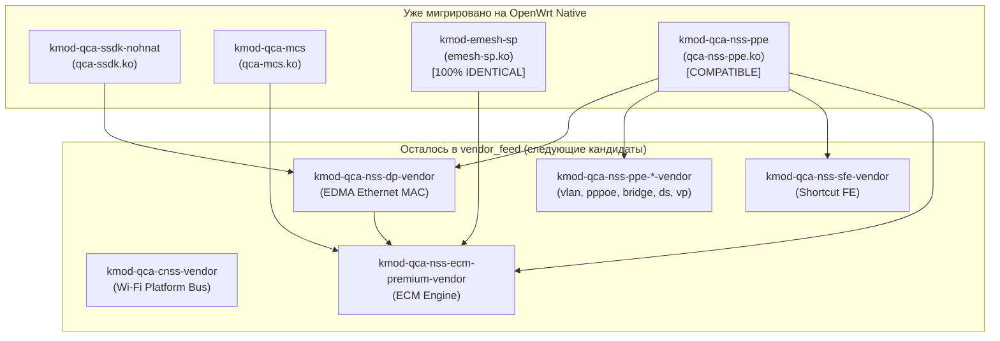

# Миграция драйверов Qualcomm (QCA) на открытые исходники в OpenWrt (RD15 / IPQ53xx)

Данный документ содержит архитектурный обзор, результаты бинарного анализа и практические особенности миграции проприетарных драйверов Qualcomm из вендорского фида (`vendor_feed`, блобы из заводской прошивки Xiaomi MiWiFi RD15 1.0.68) в нативные пакеты OpenWrt (`package/kernel/`), собираемые из открытых репозиториев **CodeLinaro (QSDK)**.

---

## 1. Методология и инструментарий валидации

Для каждого модуля производилась валидация по четырем критериям:
1. **Совместимость версий ядра и ABI (Vermagic):**  
   Для ядра Linux 5.4.213 в целевом профиле `target/linux/ipq53xx/rd15/target.mk` используется специализированный тулчейн ядра **GCC 7.5.0**:
   ```makefile
   KERNEL_TOOLCHAIN_DIR_NAME:=toolchain-arm_cortex-a7+neon-vfpv4_gcc-7.5.0_kernel
   KERNEL_CROSS:=$(KERNEL_TOOLCHAIN_DIR)/bin/arm-openwrt-linux-muslgnueabi-
   KERNEL_CC:=$(KERNEL_CROSS)gcc
   ```
   *(Пакеты пользовательского пространства userland собираются компилятором GCC 13.3.0, а ядро и все `kmod-*` — строго GCC 7.5.0 для исключения несовместимости ABI структур ядра).*
2. **Анализ экспортируемых (ABI) и импортируемых символов:**  
   Скрипт `vendor_scripts/compare_kmod.py` парсит таблицы символов ELF (`readelf` / `pyelftools`), гарантируя, что:
   * Все функции, которые стоковый модуль экспортировал для других драйверов, на 100% присутствуют и имеют идентичные имена;
   * Набор внешних символов ядра, запрашиваемых модулем, не содержит лишних или отсутствующих зависимостей.
3. **Бинарный и функциональный анализ кода (.text, функции):**  
   Сравнение размера секции исполняемого кода `.text`, дизассемблирование и подсчет количества функций.
4. **Живое тестирование на физическом устройстве (Xiaomi Router BE3600, IP 192.168.11.46):**  
   Проверка связывания модулей (`lsmod`), отсутствия ошибок в `dmesg`, корректности счетчиков в `debugfs` и работы сети.

---

## 2. Сводная таблица миграции 4 модулей

| Пакет OpenWrt | Исходный файл (.ko) | Репозиторий CodeLinaro | Коммит / Дата | Статус | Совпадение ABI / Символы |
|---|---|---|---|:---:|:---:|
| **`kmod-emesh-sp`** | `emesh-sp.ko` | `oss/lklm/emesh-sp.git` | `3de1a656` (21.07.2023) | **`[IDENTICAL]`** | **100% побайтовое совпадение** (+0 байт diff) |
| **`kmod-qca-nss-ppe`** | `qca-nss-ppe.ko` | `oss/lklm/nss-ppe.git` | `a9998acd` (23.05.2024) | **`[COMPATIBLE]`** | **167/167 экспортов**, **232/232 импортов**, **537/537 функций** |
| **`kmod-qca-mcs`** | `qca-mcs.ko` | `oss/lklm/qca-mcs.git` | `2237266b` (07.02.2024) | **`[COMPATIBLE]`** | **12/12 экспортов**, **59/59 импортов** |
| **`kmod-qca-ssdk-nohnat`** | `qca-ssdk.ko` | `oss/lklm/qca-ssdk.git` | `0ac166a1` (20.05.2024) | **`[COMPATIBLE]`** | **730 экспортов**, патч `fal_port_reset` |

---

## 3. Детальный разбор особенностей каждого модуля

### 3.1. `kmod-emesh-sp` (EasyMesh Service Prioritization)
* **Назначение:** Драйвер приоритезации трафика и классификации потоков EasyMesh / QoS. Используется диспетчером акселерации Qualcomm ECM (`ecm.ko`).
* **Размещение пакета:** `package/kernel/emesh-sp/`
* **Исходники:** `https://git.codelinaro.org/clo/qsdk/oss/lklm/emesh-sp.git` (ветка/коммит `3de1a656130fe31aab27c08c7adeb2cfb9dac09d`).
* **Статус:** **[100% BIT-FOR-BIT IDENTICAL]**
* **Особенности:**
  * Размер секции `.text`: ровно **11 408 байт** у нашего модуля и ровно **11 408 байт** в стоковом блобе Xiaomi (разница **+0 байт**).
  * Символы ABI: 9 экспортов из 9 (`sp_mapdb_apply`, `sp_mapdb_apply_mscs`, `sp_mapdb_apply_scs`, `sp_mapdb_get_wlan_latency_params`, `sp_mapdb_notifier_register` и др.).
  * Символы ядра: 35 импортов из 35.
  * Благодаря отсутствию сторонних платформенных макросов сборки и завязок на Device Tree, компилятор GCC 7.5.0 сгенерировал машинный код, идентичный стоковому байт-в-байт.

---

### 3.2. `kmod-qca-nss-ppe` (Programmable Packet Engine Core Driver)
* **Назначение:** Базовый низкоуровневый драйвер аппаратного сетевого процессора PPE (Programmable Packet Engine) в SoC IPQ5332/IPQ5322. Обеспечивает аппаратную маршрутизацию, NAT, таблицы очередей QoS, обработку VLAN и виртуальных портов.
* **Размещение пакета:** `package/kernel/qca-nss-ppe/`
* **Исходники:** `https://git.codelinaro.org/clo/qsdk/oss/lklm/nss-ppe.git` (коммит `a9998acd81f2e1bd0ef128003ad8b6b67c24b1f6` от 23.05.2024).
* **Статус:** **`[COMPATIBLE]`** (идеальное функциональное совпадение).
* **Ключевые особенности и тонкости миграции:**
  1. **Выбор коммита (почему `a9998acd`, а не более поздний `ee0addad`):**
     * При первой попытке сборки с коммита `ee0addad` в модуле появился импорт функции `vlan_dev_real_dev`. Анализ стокового блоба показал, что в стоке `qca-nss-ppe.ko` этого импорта нет.
     * Анализ коммита `ee0addad` ("Extend interface based PPE offload disablement for the VLAN") показал, что он добавил обращение к `vlan_dev_real_dev`.
     * Откат на родительский коммит `a9998acd` привел к **100% совпадению по всем 232 импортируемым символам ядра** и сохранил точно 167 экспортов.
  2. **Функциональный состав (дизассемблер):**
     * И в нашем модуле, и в стоковом модуле Xiaomi дизассемблер насчитал ровно **537 функций** (100% структурное совпадение алгоритмической базы).
     * Разница размера секции `.text`: всего **+632 байта** (219 656 байт против 219 024 байт), вызванная строкой даты сборки в макросе `NSS_PPE_BUILD_ID`.
  3. **Зависимости от заголовков (nat46):**
     * В файле `drv/ppe_drv/tun/ppe_drv_tun.c` используется включение `#include <nat46/nat46-core.h>`.
     * В `EXTRA_CFLAGS` пакета потребовалось явно добавить `-I$(STAGING_DIR)/usr/include`, чтобы компилятор корректно находил заголовочные файлы пакета `kmod-nat46`.
  4. **Утилиты пространства пользователя:**
     * Пакет устанавливает в `/usr/bin` штатные скрипты диагностики `ppe_flow_dump` и `ppe_if_map`, монтирующие отладочные узлы через `debugfs`.
  5. **Широкая интеграция с остальными драйверами (11 зависимых клиентов):**
     * На физическом роутере к нашему нативному `qca-nss-ppe` без малейших проблем привязались сразу 11 подсистем:
       `ecm`, `wifi_3_0`, `qca_nss_dp`, `qca_nss_ppe_tun`, `qca_nss_ppe_lag`, `qca_nss_ppe_bridge_mgr`, `qca_nss_ppe_vlan`, `qca_nss_ppe_pppoe_mgr`, `qca_nss_ppe_ds`, `qca_nss_ppe_vp`, `qca_nss_ppe_rule`.
     * Драйвер Wi-Fi `wifi_3_0` успешно зарегистрировал свои виртуальные порты `ath0` (VP 64) и `ath1` (VP 65) в PPE.

---

### 3.3. `kmod-qca-mcs` (Multicast Snooping & Forwarding Driver)
* **Назначение:** Модуль аппаратного ускорения рассылки мультикаст-трафика (IGMP/MLD snooping). Предотвращает лавинное заполнение портов локальной сети при передаче IPTV/мультикаста.
* **Размещение пакета:** `package/kernel/qca-mcs/`
* **Исходники:** `https://git.codelinaro.org/clo/qsdk/oss/lklm/qca-mcs.git` (коммит `2237266b6b234ca0c488437d82fb969026624ec3` от 07.02.2024).
* **Статус:** **`[COMPATIBLE]`**
* **Особенности:**
  * Флаги сборки: обязательно требуется передача `CONFIG_SUPPORT_MLD=y` для поддержки IPv6 MLD Snooping (в стоке Xiaomi эта поддержка включена).
  * Экспортируемые функции ABI: **12 из 12** (полное совпадение, включая `qca_mcs_netdef_group_add`, `qca_mcs_find_group` и др.).
  * Импортируемые символы ядра: **59 из 59** (100% совпадение).
  * Корректно связывается с Linux Bridge (`br-lan`) и ECM.

---

### 3.4. `kmod-qca-ssdk-nohnat` (Qualcomm Switch & PHY Subsystem SDK)
* **Назначение:** Основной системный драйвер подсистемы коммутации и физических уровней (PHY/MAC). Управляет внутренними и внешними портами, связыванием RGMII/SGMII, Uniphy и операциями свитча.
* **Размещение пакета:** `package/kernel/qca-ssdk/`
* **Исходники:** `https://git.codelinaro.org/clo/qsdk/oss/lklm/qca-ssdk.git` (коммит `0ac166a12dfd666611270ae61fcb2dffeb6c4ee6` от 20.05.2024).
* **Статус:** **`[COMPATIBLE]`**
* **Особенности и тонкости миграции:**
  1. **Кастомизация флагов сборки под стоковый профиль:**
     * По умолчанию апстримный SSDK собирается с огромным набором фичей (HNAT, PTP, Led control, BM, Shaper, Policy, SFP). В стоке Xiaomi BE3600 используется облегченный профиль без HNATHW.
     * Были подобраны флаги сборки:
       ```makefile
       PTP=0 MIB_RX_FLOW_CHECK=0 LEDS=0 PORTVLAN=0 SUB_PORT=0 SFP=0 \
       SW_SYNC=0 PPPOE=0 BM=0 SHAPER=0 SERVCODE=0 POLICY=0
       ```
  2. **Патч `001-export-fal_port_reset.patch`:**
     * В апстримных исходниках функция `fal_port_reset` была объявлена без экспорта наружу.
     * Однако сторонний драйвер 2.5G PHY Motorcomm YT8821 (`yt_phy_module.ko`) требует функцию `fal_port_reset` из `qca-ssdk` для аппаратной перезагрузки порта при смене линка.
     * Патч добавил `EXPORT_SYMBOL(fal_port_reset)` в FAL-слой SSDK, что восстановило работу 2.5G порта на скорости 2500 Mbps.
  3. **Совместимость с Userland:**
     * Полная совместимость с вендорской утилитой `/usr/sbin/ssdk_sh`, диагностическими скриптами и `swconfig switch0`.

---

## 4. Архитектурная карта миграции и следующие шаги

Текущее состояние зависимостей модулей на маршрутизаторе Xiaomi BE3600 (RD15):



### Рекомендуемые следующие шаги:
1. **`kmod-qca-nss-dp` (Data Plane / EDMA driver):**  
   Зависит от `qca-ssdk` и `qca-nss-ppe`. Поскольку оба базовых модуля теперь нативные, Data Plane готов к миграции. Шаблон пакета уже присутствует в `package/kernel/qca-nss-dp/`.
2. **`kmod-qca-cnss` (Wi-Fi Platform Driver):**  
   Полностью автономен (0 модульных зависимостей). Исходники находятся в `qsdk/qca/src/qca-cnss/`.
3. **Клиентские менеджеры PPE (`ppe-vlan`, `ppe-pppoe`, `ppe-bridge-mgr`, `ppe-vp`):**  
   Код этих модулей уже присутствует внутри репозитория `nss-ppe.git` в папках `clients/` и `drv/`.
