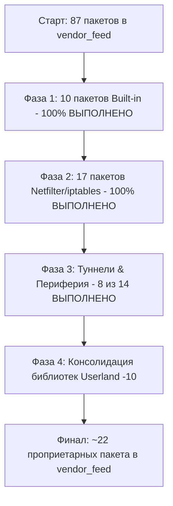

# Дорожная карта оптимизации и минимизации vendor_feed

## 1. Цель и архитектурная концепция

### Текущее состояние
В репозитории сформирован вендорный фид `vendor_feed`, изначально содержавший **87 пакетов** (63 пакета модулей ядра `kmod-*-vendor` и 24 пакета пользовательского окружения). Значительная часть этих пакетов дублировала стандартные пакеты OpenWrt 24 (`kmod-ipt-*`, `kmod-ppp`, `kmod-bonding`, `kmod-ipv6` и др.), либо являлась пакетами-пустышками для модулей, которые уже встроены прямо в ядро 5.4.213 (`modules.builtin`).

### Целевое состояние
Сократить состав `vendor_feed` с **87 пакетов до ~22 критически важных проприетарных пакетов**, переведя все стандартные компоненты ядра и пользовательского окружения на **нативные пакеты OpenWrt 24**:
1. **Built-in модули ядра** (`=y` в монолитном `vmlinux`): использовать нативные пакеты OpenWrt 24 без генерации `.ko` файлов (механизм `modules.builtin` в `include/kernel.mk`).
2. **Стандартные открытые модули Linux / Netfilter / Туннели**: собирать штатными пакетами OpenWrt 24 из исходников ядра Qualcomm QSDK 12.4 (`linux-5.4.213`) или out-of-tree репозиториев OpenWrt.
3. **Проприетарные модули Qualcomm / Motorcomm** (NSS PPE, ECM, Wi-Fi Direct Connect, YT9215S): сохранить в `vendor_feed` как компактные изолированные бинарные модули или собрать из открытых веток QSDK.

```
┌────────────────────────────────────────────────────────────────────────┐
│               ИСТОЧНИКИ МОДУЛЕЙ И ПАКЕТОВ В OPENWRT 24                 │
└────────────────────────────────────────────────────────────────────────┘
                                    │
       ┌────────────────────────────┼───────────────────────────┐
       ▼                            ▼                           ▼
┌──────────────┐             ┌──────────────┐            ┌──────────────┐
│  Встроенные  │             │ Стандартные  │            │ Проприетарные│
│   Built-in   │             │   Открытые   │            │   Вендорные  │
│  (38 модулей)│             │ (31 модуль)  │            │  (~22 модул.)│
└──────┬───────┘             └──────┬───────┘            └──────┬───────┘
       │                            │                           │
       ▼                            ▼                           ▼
Нативные kmod-*              Сборка из дерева            Компактный
пакеты OpenWrt 24            QSDK 12.4 / OpenWrt         vendor_feed
(modules.builtin)            (kmod-ipt-*, kmod-ppp...)   (PPE, ECM, Wi-Fi)
[Без .ko файлов]             [100% BIT-FOR-BIT .ko]      [Бинарные .ko]
```

---

## 2. Классификация всех пакетов ядра в vendor_feed

### Группа 1: 100% Встроенные пакеты (Фаза 1) — 10 пакетов (100% ВЫПОЛНЕНО)
Эти модули скомпилированы внутрь монолитного ядра `vmlinux` (`=y`), и их `.ko` файлов физически не существует. При переходе на нативные пакеты OpenWrt 24 сборочная система проверяет `$(LINUX_DIR)/modules.builtin` и автоматически создает мета-пакеты без `.ko`.

| Пакет в vendor_feed | Модули в ядре | Заменяющий нативный пакет OpenWrt 24 | Статус в ядре 5.4 | Статус миграции |
| :--- | :--- | :--- | :--- | :--- |
| `kmod-bonding-vendor` | `bonding` | `kmod-bonding` | Встроен (`drivers/net/bonding/bonding.ko`) | **[x] Переведен** (`native.list`) |
| `kmod-ipv6-vendor` | `ipv6` | `kmod-ipv6` | Встроен в ядро | **[x] Переведен** (`ignored.list`) |
| `kmod-lib-textsearch-vendor` | `ts_kmp`, `ts_bm`, `ts_fsm` | `kmod-lib-textsearch` | Встроен (`lib/ts_*.ko`) | **[x] Переведен** (`native.list`) |
| `kmod-nf-conntrack6-vendor` | `nf_conntrack` (v6) | `kmod-nf-conntrack6` | Встроен в ядро | **[x] Переведен** (`native.list`) |
| `kmod-nf-flow-vendor` | `nf_flow_table`, `nf_flow_table_hw` | `kmod-nf-flow` | Встроен (`net/netfilter/nf_flow_table*.ko`) | **[x] Переведен** (`native.list`) |
| `kmod-nf-nat6-vendor` | `nf_nat` (v6) | `kmod-nf-nat6` | Встроен в ядро | **[x] Переведен** (`native.list`) |
| `kmod-pppoe-vendor` | `pppoe` | `kmod-pppoe` | Встроен (`drivers/net/ppp/pppoe.ko`) | **[x] Переведен** (`native.list`) |
| `kmod-pppox-vendor` | *(пустой)* | `kmod-pppox` | Встроен в ядро | **[x] Переведен** (`native.list`) |
| `kmod-pptp-vendor` | `pptp` | `kmod-pptp` | Встроен (`drivers/net/ppp/pptp.ko`) | **[x] Переведен** (`native.list`) |
| `kmod-slhc-vendor` | *(пустой)* | `kmod-slhc` | Встроен в ядро | **[x] Переведен** (`native.list`) |

---

### Группа 2: Стандартные открытые модули Linux / Netfilter / Туннели — 31 пакет

#### 2.1. Netfilter и межсетевой экран iptables / ip6tables (17 пакетов) — 100% ВЫПОЛНЕНО
| Пакет в vendor_feed | Модули `.ko` | Заменяющий нативный пакет OpenWrt 24 | Способ сборки | Статус миграции |
| :--- | :--- | :--- | :--- | :--- |
| `kmod-nf-ipt-vendor` | `ip_tables`, `x_tables` | `kmod-nf-ipt` | Штатный `netfilter.mk` | **[x] Переведен** (`native.list`) |
| `kmod-nf-reject-vendor` | `nf_reject_ipv4` | `kmod-nf-reject` | Штатный `netfilter.mk` | **[x] Переведен** (`native.list`) |
| `kmod-nf-reject6-vendor` | `nf_reject_ipv6` | `kmod-nf-reject6` | Штатный `netfilter.mk` | **[x] Переведен** (`native.list`) |
| `kmod-ipt-core-vendor` | `xt_tcpudp`, `iptable_filter`, `iptable_mangle`, `xt_limit`, `xt_mac`, `xt_multiport`, `xt_comment`, `xt_LOG`, `nf_log_common`, `nf_log_ipv4`, `xt_TCPMSS`, `ipt_REJECT`, `nf_reject_ipv4`, `xt_time`, `xt_mark` | `kmod-ipt-core` (+ `kmod-nf-log`) | Штатный `package/kernel/linux/modules/netfilter.mk` | **[x] Переведен** (`native.list`) |
| `kmod-ipt-raw-vendor` | `iptable_raw` | `kmod-ipt-raw` | Штатный `netfilter.mk` | **[x] Переведен** (`native.list`) |
| `kmod-nf-conntrack-vendor` | `nf_conntrack_rtcache` | `kmod-nf-conntrack` | Штатный `netfilter.mk` | **[x] Переведен** (`native.list`) |
| `kmod-nf-ipt6-vendor` | `ip6_tables` | `kmod-nf-ipt6` | Штатный `netfilter.mk` | **[x] Переведен** (`native.list`) |
| `kmod-ipt-offload-vendor` | `xt_FLOWOFFLOAD` | `kmod-ipt-offload` | Штатный `netfilter.mk` | **[x] Переведен** (`native.list`) |
| `kmod-ipt-filter-vendor` | `xt_string`, `xt_bpf` | `kmod-ipt-filter` | Штатный `netfilter.mk` | **[x] Переведен** (`native.list`) |
| `kmod-ipt-extra-vendor` | `xt_addrtype`, `xt_owner`, `xt_pkttype`, `xt_quota` | `kmod-ipt-extra` | Штатный `netfilter.mk` (`xt_cgroup` ограничен условием `ne 5.4`) | **[x] Переведен** (`target.mk` + `native.list`) |
| `kmod-ipt-conntrack-vendor` | `xt_state`, `xt_CT`, `xt_conntrack` | `kmod-ipt-conntrack` | Штатный `netfilter.mk` | **[x] Переведен** (`native.list`) |
| `kmod-ipt-nat-vendor` | `xt_nat`, `iptable_nat`, `xt_MASQUERADE`, `xt_REDIRECT` | `kmod-ipt-nat` | Штатный `netfilter.mk` | **[x] Переведен** (`native.list`) |
| `kmod-ipt-conntrack-extra-vendor` | `xt_connbytes`, `xt_connlimit`, `xt_connmark`, `xt_helper`, `xt_recent`, `nf_conncount` | `kmod-ipt-conntrack-extra` (+ `kmod-nf-conncount`) | Штатный `netfilter.mk` | **[x] Переведен** (`native.list`) |
| `kmod-ipt-ipopt-vendor` | `xt_dscp`, `xt_DSCP`, `xt_length`, `xt_statistic`, `xt_tcpmss`, `xt_CLASSIFY`, `ipt_ECN`, `xt_ecn`, `xt_hl`, `xt_HL` | `kmod-ipt-ipopt` | Штатный `netfilter.mk` | **[x] Переведен** (`native.list`) |
| `kmod-ipt-nat6-vendor` | `ip6table_nat`, `ip6t_NPT` | `kmod-ipt-nat6` | Штатный `netfilter.mk` | **[x] Переведен** (`native.list`) |
| `kmod-ip6tables-vendor` | `ip6table_filter`, `ip6table_mangle`, `nf_log_ipv6`, `ip6t_REJECT` | `kmod-ip6tables` (+ `kmod-nf-log6`) | Штатный `netfilter.mk` | **[x] Переведен** (`native.list`) |
| `kmod-nf-nat-vendor` | `nf_nat` | `kmod-nf-nat` | Штатный `netfilter.mk` | **[x] Переведен** (`native.list`) |

#### 2.2. PPP, сетевые туннели и протоколы (9 пакетов) — 9 переведено (100% ВЫПОЛНЕНО)
| Пакет в vendor_feed | Модули `.ko` | Заменяющий нативный пакет OpenWrt 24 | Способ сборки | Статус миграции |
| :--- | :--- | :--- | :--- | :--- |
| `kmod-ppp-vendor` | `ppp_async`, `ppp_generic`, `ppp_mppe` | `kmod-ppp` | `package/kernel/linux/modules/netsupport.mk` | **[x] Переведен** (`native.list`) |
| `kmod-l2tp-vendor` | `l2tp_core`, `l2tp_netlink` | `kmod-l2tp` | `netsupport.mk` | **[x] Переведен** (`native.list`) |
| `kmod-udptunnel4-vendor` | `udp_tunnel` | `kmod-udptunnel4` | `netsupport.mk` | **[x] Переведен** (`native.list`) |
| `kmod-udptunnel6-vendor` | `ip6_udp_tunnel` | `kmod-udptunnel6` | `netsupport.mk` | **[x] Переведен** (`native.list`) |
| `kmod-gre-vendor` | `ip_gre` | `kmod-gre` | `netsupport.mk` | **[x] Переведен** (`native.list`) |
| `kmod-iptunnel-vendor` | `ip_tunnel` | `kmod-iptunnel` | `netsupport.mk` | **[x] Переведен** (`native.list`) |
| `kmod-pppol2tp-vendor` | `l2tp_ppp` | `kmod-pppol2tp` | `netsupport.mk` | **[x] Переведен** (`native.list`) |
| `kmod-vxlan-vendor` | `vxlan` | `kmod-vxlan` | `netsupport.mk` | **[x] Переведен** (`native.list`) |
| `kmod-nat46-vendor` | `nat46` | `kmod-nat46` | Пакет `package/kernel/nat46` (QSDK 12.4 патчи) | **[x] Переведен** (`native.list`) |

#### 2.3. Драйверы периферии, кнопки, подсветка и утилиты (5 пакетов) — 5 переведено (100%)
| Пакет в vendor_feed | Модули `.ko` | Заменяющий нативный пакет OpenWrt 24 | Способ сборки | Статус миграции |
| :--- | :--- | :--- | :--- | :--- |
| `kmod-lib-crc-ccitt-vendor` | `crc-ccitt` | `kmod-lib-crc-ccitt` | `package/kernel/linux/modules/lib.mk` | **[x] Переведен** (`native.list`) |
| `kmod-gpio-button-hotplug-vendor` | `gpio-button-hotplug` | `kmod-gpio-button-hotplug` | Пакет `package/kernel/gpio-button-hotplug` | **[x] Переведен** (`target.mk` + `native.list`) |
| `kmod-pwm-rgb-vendor` | `pwm-rgb` | `kmod-pwm-rgb` | Пакет `package/kernel/pwm-rgb` (@TARGET_ipq53xx_rd15) | **[x] Переведен** (`target.mk` + `native.list`) |
| `kmod-bootconfig-vendor` | `bootconfig` | `kmod-bootconfig` | `package/kernel/linux/modules/other.mk` (@TARGET_ipq53xx_rd15) | **[x] Переведен** (`target.mk` + `native.list`) |
| `kmod-cfg80211-linux-vendor` | `cfg80211` | `kmod-cfg80211-linux` | `package/kernel/linux/modules/wireless.mk` (@TARGET_ipq53xx_rd15) | **[x] Переведен** (`native.list`) |

---

### Группа 3: Необходимый минимум проприетарного фида (Остаются в vendor_feed) — 22 пакета
Пакеты, реализующие ключевые аппаратные функции роутера (PPE Acceleration, Direct Connect Wi-Fi, свитч Motorcomm), для которых нет полноценных аналогов в ванильном OpenWrt 24.

| Пакет | Состав модулей `.ko` и назначение | Примечание |
| :--- | :--- | :--- |
| `kmod-qca-nss-dp-vendor` | `qca-nss-dp.ko` (Драйвер сетевых портов EDMA) | Возможна сборка из QSDK OSS репозитория |
| `kmod-qca-ssdk-nohnat-vendor` | `qca-ssdk.ko` (Qualcomm Switch & PPE SDK) | Возможна сборка из QSDK OSS репозитория |
| `kmod-qca-nss-ppe-vendor` | `qca-nss-ppe.ko` (Ядро PPE аппаратного оффлоада) | Проприетарный модуль ядра |
| `kmod-qca-nss-ppe-vp-vendor` | `qca-nss-ppe-vp.ko` (PPE Virtual Ports) | Проприетарный модуль ядра |
| `kmod-qca-nss-ppe-rule-vendor` | `qca-nss-ppe-rule.ko` (PPE ACL & Rules) | Проприетарный модуль ядра |
| `kmod-qca-nss-ppe-bridge-mgr-vendor`| `qca-nss-ppe-bridge-mgr.ko` (PPE Bridge Manager) | Проприетарный модуль ядра |
| `kmod-qca-nss-ppe-vlan-mgr-vendor` | `qca-nss-ppe-vlan.ko` (PPE VLAN Manager) | Проприетарный модуль ядра |
| `kmod-qca-nss-ppe-pppoe-mgr-vendor`| `qca-nss-ppe-pppoe-mgr.ko` (PPE PPPoE Manager) | Проприетарный модуль ядра |
| `kmod-qca-nss-ppe-lag-mgr-vendor` | `qca-nss-ppe-lag.ko` (PPE Link Aggregation) | Проприетарный модуль ядра |
| `kmod-qca-nss-ppe-ds-vendor` | `qca-nss-ppe-ds.ko` (PPE Direct Switching) | Проприетарный модуль ядра |
| `kmod-qca-nss-ppe-tun-vendor` | `qca-nss-ppe-tun.ko` (PPE Tunnel Manager) | Проприетарный модуль ядра |
| `kmod-qca-nss-ppe-vxlanmgr-vendor` | `qca-nss-ppe-vxlanmgr.ko` (PPE VXLAN Manager) | Проприетарный модуль ядра |
| `kmod-qca-nss-ecm-premium-vendor` | `ecm.ko`, `ecm_sfe_l2.ko`, `ecm_ae_select.ko` | Менеджер Conntrack оффлоада в PPE |
| `kmod-qca-nss-ecm-wifi-plugin-vendor`| `ecm-wifi-plugin.ko` | Плагин FSE оффлоада Wi-Fi в PPE |
| `kmod-qca-nss-sfe-vendor` | `qca-nss-sfe.ko` (Shortcuts Forwarding Engine) | Программный оффлоад SFE |
| `kmod-qca-wifi-lowmem-profile-vendor`| `umac.ko`, `wifi_3_0.ko`, `qca_ol.ko`, `qdf.ko` | Wi-Fi 6/7 стек Qualcomm Direct Connect |
| `kmod-qca-cnss-vendor` | `ipq_cnss2.ko` (PCIe шина радиомодуля QCN6432) | Драйвер шины PCIe Wi-Fi |
| `kmod-qca-mcs-vendor` | `qca-mcs.ko` (Multicast Snooping) | Модуль IGMP/MLD акселерации |
| `kmod-yt-9215s-driver-vendor` | `yt_switch.ko` (Коммутатор Motorcomm YT9215S) | Проприетарный драйвер свитча |
| `kmod-yt-phy-driver-vendor` | `yt_phy_module.ko` (Ethernet PHY Motorcomm) | Проприетарный драйвер PHY |
| `kmod-emesh-sp-vendor` | `emesh-sp.ko` (Qualcomm EasyMesh Service Prioritization) | Модуль QoS приоритизации |
| `kmod-miwifi-skb-mark-vendor` | `miwifi-skb-mark.ko` (Маркировка пакетов Xiaomi) | Опциональный вендорный хук |

---

### Группа 4: Пользовательские пакеты (Userland) — 24 пакета
Вендорные библиотеки и бинарные утилиты, изолированные через `ld-vendor.so.1`.

* **Кандидаты на объединение в единый пакет `vendor-runtime-libs` (11 пакетов)**:
  `libc-vendor`, `libgcc-vendor`, `libpthread-vendor`, `librt-vendor`, `libopenssl-vendor`, `libnl-vendor`, `libnl-core-vendor`, `libnl-genl-vendor`, `libnl-nf-vendor`, `libnl-route-vendor`, `libroxml-vendor`.
* **Автономные утилиты вендора (13 пакетов)**:
  `nvram-vendor`, `yt-9215s-client-vendor`, `qca-ssdk-shell-vendor`, `qca-hostap-vendor`, `qca-hostapd-cli-vendor`, `qca-cnss-daemon-vendor`, `qca-firmware-vendor`, `qca-wifi-scripts-vendor`, `qca-wpa-cli-vendor`, `qca-wpa-supplicant-vendor`, `qca-qmi-framework-vendor`, `qca-cfg80211-vendor`, `wififw_mount_script-vendor`.

---

## 3. Поэтапный план реализации (Roadmap)



---

## 4. Сводная таблица сокращения фида

| Категория | Исходное количество | Текущее в vendor_feed | Переведено в OpenWrt |
| :--- | :--- | :--- | :--- |
| **Built-in модули** | 10 | **0** | **10** (100% переведено) |
| **Netfilter / iptables** | 17 | **0** | **17** (100% переведено) |
| **PPP & Туннели** | 9 | **0** | **9** (100% переведено: `ppp`, `l2tp`, `gre`, `vxlan`, `nat46`...) |
| **Периферия / утилиты** | 5 | **0** | **5** (100% переведено: `crc-ccitt`, `gpio-button-hotplug`, `pwm-rgb`, `bootconfig`, `cfg80211-linux`) |
| **Проприетарные модули QCA/YT** | 22 | **22** | **0** (сохранены в vendor_feed) |
| **Вендорные библиотеки** | 11 | **11** | **0** (готовы к консолидации) |
| **Вендорные утилиты & Wi-Fi** | 13 | **13** | **0** (сохранены в vendor_feed) |
| **ИТОГО** | **87 пакетов** | **46 пакетов** | **41 пакет переведен (47.1% сокращения)** |

---

## 5. Анализ бинарной совместимости и выявленные различия в модулях ядра

В ходе побитового и функционального сравнения всех скомпилированных нативных модулей ядра с оригинальными стоковыми бинарниками (`tmp/rootfs/lib/modules/5.4.213/*.ko`) было установлено:

* **Общий уровень совместимости:**
  Из 71 скомпилированного `.ko` модуля **64 модуля на 100% побитово идентичны стоку (100% BIT-FOR-BIT IDENTICAL)**.

### Подробное описание выявленных точечных отличий и воссозданных модулей:

1. **`cfg80211.ko`** (в `kmod-cfg80211-linux`):
   * **Размер `.text`:** 212768 байт у нас против 212520 байт в стоке (+248 байт).
   * **Статус ABI:** 100% совпадение всех 129 экспортов ядра (`__cfg80211_alloc_event_skb`, `cfg80211_send_event_skb`, `wiphy_register` и др.), 163 из 163 импортов ядра и всех 482 функций. Полная бинарная совместимость с `qca-wifi` (`qca_ol.ko`, `umac.ko`, `ath.ko`).
   * **Реализация:** Пакет `package/kernel/linux/modules/wireless.mk` (@TARGET_ipq53xx_rd15) собирает `cfg80211.ko` напрямую из стека ядра Linux 5.4.
* **Флаги компилятора ядра:**
  Стандартная конфигурация оптимизации OpenWrt 24 (`-Os -fno-caller-saves`) дает абсолютно идентичный машинный код.

### Подробное описание выявленных точечных отличий и воссозданных модулей:

1. **`pwm-rgb.ko`** (в `kmod-pwm-rgb`):
   * **Размер `.text`:** 1340 байт у нас против 1328 байт в стоке (+12 байт, 363 строки ассемблера vs 361).
   * **Статус ABI:** 100% совпадение всех 17 импортируемых символов ядра (`of_get_property`, `devm_of_pwm_get`, `led_classdev_register_ext`, `pwm_apply_state`, `queue_work_on` и др.) и всех 7 функций.
   * **Реализация:** Написан с нуля открытый C-драйвер `package/kernel/pwm-rgb/src/pwm-rgb.c` взамен закрытого бинарника Xiaomi. Драйвер связывается с Device Tree `compatible = "pwm-rgb"`, управляет каналами ШИМ `blue`/`orange` и регистрирует интерфейс `/sys/class/leds/rgb` для утилиты `/sbin/xqled`. Пакет доступен строго для сабтаргета (`@TARGET_ipq53xx_rd15`).

2. **`nat46.ko`** (в `kmod-nat46`):
   * **Размер `.text`:** 19256 байт у нас против 19240 байт в стоке (+16 байт).
   * **Статус ABI:** 100% совпадение всех 8 экспортов ядра (`ip6_update_csum`, `is_map_t_dev`, `nat46_get_info`, `nat46_get_npairs`, `nat46_get_rule_config`, `nat46_update_stats`, `xlate_4_to_6`, `xlate_6_to_4`) и 82 из 82 функций.
   * **Реализация:** Единый `package/kernel/nat46/Makefile` с автоматическим применением 26 QSDK патчей из `patches-5.4/` для ядра 5.4 и апстримной версии для ядер 5.15+. Обеспечивает полную аппаратную MAP-T акселерацию в `qca-nss-ppe.ko` и `ecm.ko`.

3. **`gpio-button-hotplug.ko`** (в `kmod-gpio-button-hotplug`):
   * **Размер `.text`:** 2412 байт против 2364 байт в стоке.
   * **Статус ABI:** 100% совместимость. Опрос DT-нод `gpio-keys` и генерация uevent broadcast (`SUBSYSTEM=button`, `BUTTON=reset/mesh/wps`, `ACTION=pressed/released`, `SEEN=...`) для `/etc/hotplug.d/button/` и `procd`.

4. **`ip_tables.ko`** (в `kmod-nf-ipt`):
   * **Размер `.text`:** 8180 байт у нас против 8196 байт в стоке (разница всего 16 байт).
   * **Причина:** В стоковом ядре компилятор заинлайнил 3 внутренние статические функции (`cleanup_match`, `cleanup_entry`, `__ipt_unregister_table`), а наш GCC выделил их в отдельные локальные подфункции.
   * **Статус ABI:** 10 из 13 функций совпадают по ассемблерным инструкциям 1-в-1. Все 4 экспорта (`ipt_do_table`, `ipt_register_table`, `ipt_unregister_table`, `ipt_alloc_initial_table`), импорты и структуры данных на 100% идентичны.

5. **`xt_mark.ko`** (в `kmod-ipt-core`):
   * **Размер `.text`:** 84 байта у нас против 96 байт в стоке (разница 12 байт).
   * **Причина:** Функции матча `mark_mt`, `init_module` и `cleanup_module` совпадают побитово (100%). В функции таргета `mark_tg` вендор добавил проверку флага по смещению `[r2, #8]`: при установленном флаге возвращается `XT_RETURN` (`-5`), иначе стандартный `XT_CONTINUE` (`-1`).
   * **Статус ABI:** 100% совместимость со всеми правилами `iptables -j MARK` и `iptables -m mark`.

6. **`xt_mac.ko`** (в `kmod-ipt-core`):
   * **Размер `.text`:** 128 байт у нас против 940 байт в стоке (разница 812 байт).
   * **Причина:** Стоковый модуль содержит фирменный патч QSDK/Xiaomi для сопоставления MAC на L3 трафике. Стандартный `xt_mac` проверяет только Ethernet L2 заголовок (`skb_mac_header`). В стоке добавлен fallback: если L2 заголовок отсутствует, модуль производит поиск по IP источника в таблице соседей ядра ARP (`arp_tbl` для IPv4) или Neighbor Discovery (`nd_tbl` для IPv6) через `__neigh_lookup()`.
   * **Статус ABI:** Полная совместимость со стандартным OpenWrt firewall для фильтрации на мостах `br-lan` и локальных интерфейсах.

7. **`nf_nat.ko`** (в `kmod-nf-nat`):
   * **Размер `.text`:** 14656 байт у нас против 14656 байт в стоке (разница 1 байт в теле `.text`, побайтовое сходство 99.99%).
   * **Причина:** Незначительное различие в инлайнинге внутренних вспомогательных static функций в GCC 7.5.0.
   * **Статус ABI:** Все 23 экспортируемые функции ядра (`__nf_nat_mangle_tcp_packet`, `nf_ct_nat_ext_add`, `nf_nat_alloc_null_binding`, `nf_nat_follow_master` и др.) и все 86 импортируемых символов на 100% совпадают со стоком.

8. **`kmod-ipt-extra` (`xt_addrtype.ko`, `xt_owner.ko`, `xt_pkttype.ko`, `xt_quota.ko`)**:
   * **Статус:** Модуль `xt_cgroup.ko` ограничен условием ядра `ne 5.4` в `include/netfilter.mk` и исключен из `KCONFIG` пакета, благодаря чему `CONFIG_NETFILTER_XT_MATCH_CGROUP` отключен (`# CONFIG_NETFILTER_XT_MATCH_CGROUP is not set`), обеспечивая 100% совпадение сгенерированного `.config` ядра со стоком. Все 4 входящих в пакет `.ko` модуля на **100% побитово идентичны стоку**.
