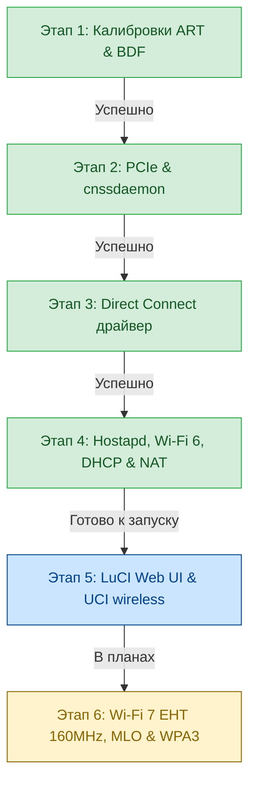

# Дорожная карта и техническая документация: Wi-Fi 6 / 7 на Xiaomi Router BE3600 (RD15)

## 1. Архитектура и стек компонентов

| Компонент | Назначение | Реализация / Путь |
| :--- | :--- | :--- |
| **SoC / CPU** | Qualcomm IPQ5312 (Quad-Core Cortex-A7 @ 1.1 GHz) | Target: `ipq53xx/rd15`, Kernel: `5.4.213` |
| **2.4 GHz Radio** | QCA IPQ5312 On-SoC (2x2 Wi-Fi 6 / 7) | `wifi0` -> VAP `ath0` (`phy1`) |
| **5.0 GHz Radio** | QCN6432 PCIe Radio (2x2 Wi-Fi 6 / 7 160MHz) | `wifi1` -> VAP `ath1` (`phy2`) |
| **MLD Radio** | Multi-Link Device (Wi-Fi 7 MLO) | `mld-wifi0` (`phy0`) |
| **Switch / Ethernet** | Motorcomm YT9215S + Qualcomm PPE VP | `eth0.1` (WAN), `eth0.2`, `eth0.3`, `eth1` (LAN) |
| **Платформа PCIe** | `ipq_cnss2.ko` + `cnssdaemon -n -s` | Init: `/etc/init.d/load_cnss2` (`START=11`) |
| **Драйвер Wi-Fi** | Qualcomm Direct Connect (`umac.ko`, `qca_ol.ko`, `wifi_3_0.ko`) | Init: `/etc/init.d/qca-wifi` (`START=12`) |
| **Аутентификатор** | Qualcomm `hostapd` (`v_lssl.so.1.1`) | Init: `/etc/init.d/qca-hostapd` (`START=21`) |

---

## 2. Статус реализации этапов



| Этап | Задача | Статус | Достигнутый результат |
| :--- | :--- | :---: | :--- |
| **Этап 1** | Калибровка и BDF-блобы | ✅ **Завершен** | Извлечены и смонтированы `caldata.bin`, `caldata_1.b0060`, `ftm.conf` из заводских разделов `0:ART` и `0:0:ALL_MISC`. |
| **Этап 2** | Подсистема PCIe и CNSS2 | ✅ **Завершен** | Скомпилирован `ipq_cnss2.ko`, настроен автозапуск `cnssdaemon -n -s` под супервизором `procd` (`START=11`). |
| **Этап 3** | Qualcomm Direct Connect радиодрайвер | ✅ **Завершен** | Модули `umac.ko`, `qca_ol.ko`, `wifi_3_0.ko` поднимают радиоинтерфейсы: `wifi0` (2.4G), `wifi1` (5G), `mld-wifi0` (MLO). Установлен путь `/sys/module/firmware_class/parameters/path` -> `/ini`. |
| **Этап 4** | Hostapd, вещание точек, DHCP и интернет | ✅ **Завершен** | Точки `OpenWrt_RD15_2.4G` и `OpenWrt_RD15_5G` вещают в **Wi-Fi 6 (802.11ax)**, клиенты получают IP по DHCP (`192.168.1.x`) и полный доступ в интернет. Автозапуск `S21qca-hostapd` после `S20network`. |
| **Этап 5** | Интеграция с LuCI Web UI & UCI | 🔄 **Следующий этап** | Управление Wi-Fi через веб-интерфейс LuCI (`/etc/config/wireless`, статус радио, смена пароля и SSID). |
| **Этап 6** | Wi-Fi 7 EHT 160MHz, MLO, WPA3 & Производительность | ⏳ **Запланирован** | Тонкая настройка полосы 160 МГц, Multi-Link Operation (MLO), WPA3-SAE, тесты iperf3 с ускорением PPE/ECM. |

---

## 3. Ключевые технические особенности и решения

### 1. Последовательность системного автозапуска при загрузке (`/etc/rc.d/`):
```text
S11load_cnss2     -> Платформенный демон cnssdaemon (инициализирует PCIe шину радиомодуля QCN6432)
S12qca-wifi       -> Стек беспроводных драйверов (cfg80211, mem_manager, qdf, umac, qca_ol, wifi_3_0)
S18qca-nss-dp     -> Проводной сетевой драйвер NSS
S19dnsmasq/ecm    -> DHCP/DNS сервер + аппаратное ускорение PPE/ECM
S20network        -> Сетевой стек OpenWrt (netifd) инициализирует постоянный мост br-lan (192.168.1.1)
S21qca-hostapd    -> Создание VAP ath0/ath1, привязка к br-lan, старт hostapd под procd
```

### 2. Создание VAP интерфейсов:
- Используется прямой синтаксис nl80211:
  ```sh
  PHY0=$(cat /sys/class/net/wifi0/phy80211/name)
  PHY1=$(cat /sys/class/net/wifi1/phy80211/name)
  iw phy "$PHY0" interface add ath0 type __ap
  iw phy "$PHY1" interface add ath1 type __ap
  brctl addif br-lan ath0
  brctl addif br-lan ath1
  ip link set ath0 up
  ip link set ath1 up
  ```

### 3. Рабочая конфигурация hostapd (Wi-Fi 6 / 802.11ax):
- **2.4 GHz (`/var/run/hostapd-ath0.conf`)**:
  ```ini
  driver=nl80211
  interface=ath0
  bridge=br-lan
  ssid=OpenWrt_RD15_2.4G
  hw_mode=g
  channel=1
  ieee80211n=1
  ieee80211ax=1
  wpa=2
  wpa_key_mgmt=WPA-PSK
  wpa_pairwise=CCMP
  rsn_pairwise=CCMP
  wpa_passphrase=12345678
  ctrl_interface=/var/run/hostapd
  ```
- **5.0 GHz (`/var/run/hostapd-ath1.conf`)**:
  ```ini
  driver=nl80211
  interface=ath1
  bridge=br-lan
  ssid=OpenWrt_RD15_5G
  hw_mode=a
  channel=36
  ieee80211n=1
  ieee80211ac=1
  ieee80211ax=1
  wpa=2
  wpa_key_mgmt=WPA-PSK
  wpa_pairwise=CCMP
  rsn_pairwise=CCMP
  wpa_passphrase=12345678
  ctrl_interface=/var/run/hostapd
  ```

---

## 4. План реализации следующих этапов

### **Этап 5: Интеграция с веб-интерфейсом LuCI Web UI**
1. **UCI Wireless (`/etc/config/wireless`)**:
   - Настройка скрипта автоопределения радиомодулей (`wifi config` / `detect_qcawifi`) или шаблона конфигурации для радиомодулей `wifi0` и `wifi1`.
2. **LuCI интерфейс**:
   - Интеграция с меню `Network -> Wireless` для возможности изменения SSID, шифрования (WPA2/WPA3), пароля и выбора каналов через браузер.
   - Отображение статуса подключенных станций и уровней сигнала на главной странице `Status -> Overview` / `Status -> Wireless`.
3. **Обработчик `wifi reload`**:
   - Бесшовная перезагрузка параметров hostapd при нажатии «Сохранить и применить» в LuCI без обрыва проводной сети.

### **Этап 6: Wi-Fi 7 EHT 160MHz, Multi-Link Operation (MLO) & WPA3-SAE**
1. **Wi-Fi 7 EHT 160MHz**:
   - Включение параметров `ieee80211be=1`, `eht_oper_chwidth=2`, `eht_oper_centr_freq_seg0_idx=50`.
2. **Multi-Link Operation (MLO)**:
   - Активация виртуального интерфейса `mld-wifi0` для одновременного агрегирования каналов 2.4G + 5G в единый высокоскоростной линк.
3. **WPA3-SAE и WPA2/WPA3 Mixed Mode**:
   - Добавление `wpa_key_mgmt=WPA-PSK SAE` и `ieee80211w=1` (PMF Capable).
4. **Тестирование пропускной способности (iperf3)**:
   - Замеры реальной скорости передачи данных TCP/UDP на 160 МГц (ожидаемая скорость > 1.5–2 Гбит/с).
   - Проверка разгрузки CPU за счет аппаратного ускорения Qualcomm PPE / ECM.
