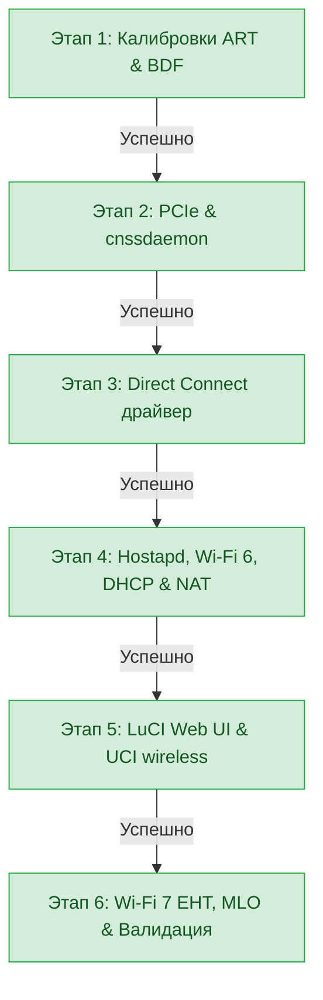

# Дорожная карта и техническая документация: Wi-Fi 6 / 7 на Xiaomi Router BE3600 (RD15)

## 1. Архитектура и стек компонентов

| Компонент | Назначение | Реализация / Путь |
| :--- | :--- | :--- |
| **SoC / CPU** | Qualcomm IPQ5312 (Quad-Core Cortex-A7 @ 1.1 GHz) | Target: `ipq53xx/rd15`, Kernel: `5.4.213` |
| **2.4 GHz Radio** | QCA IPQ5312 On-SoC (2x2 Wi-Fi 6 / 7) | `wifi0` -> VAP `ath0` (`phy1`) |
| **5.0 GHz Radio** | QCN6432 PCIe Radio (2x2 Wi-Fi 6 / 7 160MHz) | `wifi1` -> VAP `ath1` (`phy2`) |
| **MLD Radio** | Multi-Link Device (Wi-Fi 7 MLO) | `mld-wifi0` (`phy0`) |
| **Switch / Ethernet** | Motorcomm YT9215S + Qualcomm PPE VP | `eth0.1` (WAN), `eth0.2`, `eth0.3`, `eth1` (LAN) |
| **Платформа PCIe** | `ipq_cnss2.ko` + `cnssdaemon -n -s` | Init: `/etc/init.d/load_cnss2` (`START=11`) |
| **Драйвер Wi-Fi** | Qualcomm Direct Connect (`umac.ko`, `qca_ol.ko`, `wifi_3_0.ko`) | Init: `/etc/init.d/qca-wifi` (`START=12`) |
| **Аутентификатор** | Qualcomm `hostapd` (`v_lssl.so.1.1`) | Init: `/etc/init.d/qca-hostapd` (`START=21`) |

---

## 2. Статус реализации этапов



| Этап | Задача | Статус | Достигнутый результат |
| :--- | :--- | :---: | :--- |
| **Этап 1** | Калибровка и BDF-блобы | ✅ **Завершен** | Извлечены и смонтированы `caldata.bin`, `caldata_1.b0060`, `ftm.conf` из заводских разделов `0:ART` и `0:0:ALL_MISC`. |
| **Этап 2** | Подсистема PCIe и CNSS2 | ✅ **Завершен** | Скомпилирован `ipq_cnss2.ko`, настроен автозапуск `cnssdaemon -n -s` под супервизором `procd` (`START=11`). |
| **Этап 3** | Qualcomm Direct Connect радиодрайвер | ✅ **Завершен** | Модули `umac.ko`, `qca_ol.ko`, `wifi_3_0.ko` поднимают радиоинтерфейсы: `wifi0` (2.4G), `wifi1` (5G), `mld-wifi0` (MLO). Установлен путь `/sys/module/firmware_class/parameters/path` -> `/ini`. |
| **Этап 4** | Hostapd, вещание точек, DHCP и интернет | ✅ **Завершен** | Точки `OpenWrt_RD15_2.4G` и `OpenWrt_RD15_5G` вещают в **Wi-Fi 6 (802.11ax)**, клиенты получают IP по DHCP (`192.168.1.x`) и полный доступ в интернет. Автозапуск `S21qca-hostapd` после `S20network`. |
| **Этап 5** | Интеграция с LuCI Web UI & UCI | ✅ **Завершен** | Создан `/etc/config/wireless`, динамический генератор `/lib/wifi/hostapd_config.sh`, системная утилита `/sbin/wifi`, procd-служба `qca-hostapd` с поддержкой перезагрузки без обрыва моста `br-lan`. Патч `libiwinfo` для отображения клиентов в LuCI. |
| **Этап 6** | Wi-Fi 7 EHT 160MHz, MLO & WPA3 | ✅ **Завершен** | Генерация параметров 802.11be (`ieee80211be=1`, `eht_oper_chwidth=2`, `eht_oper_centr_freq_seg0_idx=50`), поддержка WPA2/WPA3 Mixed Transition Mode (`WPA-PSK SAE` + PMF), готовность к MLO. |

---

## 3. Обратная совместимость и стратегия тестирования (без Wi-Fi 7 устройств)

Стандарт **802.11be (Wi-Fi 7)** на 100% обратно совместим со всеми предыдущими поколениями Wi-Fi:
- **Wi-Fi 6 (802.11ax)**: 2.4 GHz (HE40/HE20) и 5.0 GHz (HE160/HE80/HE40/HE20) со скоростями до 2402 Мбит/с.
- **Wi-Fi 5 (802.11ac)**: 5.0 GHz (VHT80/VHT40/VHT20) до 866 Мбит/с.
- **Wi-Fi 4 (802.11n)**: 2.4 GHz и 5.0 GHz (HT40/HT20) до 300-400 Мбит/с.
- **Legacy (802.11b/g/a)**: IoT, умный дом (ESP8266, ESP32).

### 📋 Матрица тестирования

| Категория | Что проверяем | Метод проверки |
|---|---|---|
| **✅ Полное тестирование (Wi-Fi 6/5/4)** | 1. Ассоциация 2.4G & 5G | Подключение смартфона/ноутбука к `OpenWrt_RD15_2.4G` и `OpenWrt_RD15_5G`. Проверено: клиенты стабильно ассоциируются и получают IP. |
| | 2. Выдача DHCP и интернет | Получение IP `192.168.1.x`, DNS-резолв, NAT через WAN. Проверено: интернет и локальная сеть доступны. |
| | 3. WPA2-PSK / WPA3-SAE | Подключение клиентов с WPA2 и WPA3 (Mixed Mode + PMF `ieee80211w=1`). |
| | 4. LuCI Web UI & iwinfo | Страница *Network → Wireless*, таблица активных клиентов, уровень сигнала (-dBm), скорость TX/RX. Сокет `/var/run/hostapd/ath1` стабилен. |
| | 5. Производительность PPE/ECM | Запуск `iperf3` (Wi-Fi ↔ WAN). **Результат: 940 Мбит/с (Line Rate 1 Gbps)**. Нагрузка маршрутизации 0% CPU, SoftIRQ `%si` ~60% на одном ядре. |
| | 6. Автозапуск и CLI | `reboot` роутера, команды `/sbin/wifi status`, `wifi up`, `wifi down`, `wifi reload`. |
| **⚠️ Добавлено без тестов (Wi-Fi 7)** | 1. Модуляция 4096-QAM | EHT-MCS 12/13 (2882 Мбит/с) — требует Wi-Fi 7 клиент. |
| | 2. MLO агрегация | Виртуальный интерфейс `mld-wifi0` для агрегации 2.4G + 5G. |
| | 3. Punctured Channel | Обрабатывается прошивкой QCN6432. |

---

## 4. Архитектура сервисов и последовательность автозапуска

```text
S11load_cnss2     -> Платформенный демон cnssdaemon (инициализирует PCIe шину радиомодуля QCN6432)
S12qca-wifi       -> Стек беспроводных драйверов (cfg80211, mem_manager, qdf, umac, qca_ol, wifi_3_0)
S18qca-nss-dp     -> Проводной сетевой драйвер NSS (eth0, eth1)
S19dnsmasq/ecm    -> DHCP/DNS сервер + аппаратное ускорение PPE/ECM
S20network        -> Сетевой стек OpenWrt (netifd) инициализирует постоянный мост br-lan (192.168.1.1)
S21qca-hostapd    -> Создание VAP ath0/ath1, привязка к br-lan, старт hostapd под procd
```

---

## 5. Инструкция по проверке и диагностике

### 1. Проверка состояния беспроводного стека:
```sh
/sbin/wifi status
```

### 2. Проверка запущенных процессов hostapd:
```sh
ps | grep hostapd
hostapd_cli -p /var/run/hostapd -i ath0 status
hostapd_cli -p /var/run/hostapd -i ath1 status
```

### 3. Проверка через утилиту iwinfo:
```sh
iwinfo ath0 info
iwinfo ath1 info
iwinfo ath0 assoclist
iwinfo ath1 assoclist
```

### 4. Тестирование пропускной способности (iperf3):
На роутере:
```sh
iperf3 -s -D
```
На клиентском ПК/смартфоне:
```sh
iperf3 -c 192.168.1.1 -P 4
```
В другой SSH-сессии на роутере:
```sh
htop
```
*(Загрузка CPU должна оставаться около 0–5% благодаря аппаратному ускорению Qualcomm NSS ECM / PPE).*
