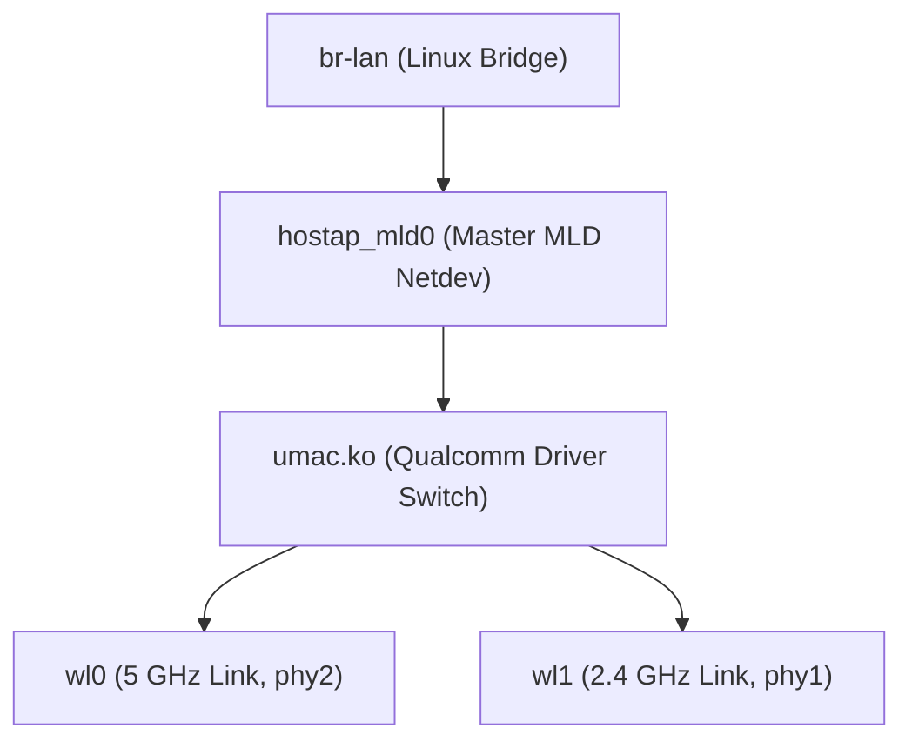

# Комплексный анализ стокового Wi-Fi стека Xiaomi BE3600 (RD15): Настройка 5G/2.4G, Wi-Fi 7 MLO, режим моста (ExtAP) и Mesh

> **Архивный технический референс**.  
> Документ объединяет и актуализирует материалы исследований стокового беспроводного стека Qualcomm QSDK 12.4 (ядро Linux 5.4.213) на базе маршрутизатора **Xiaomi Router BE3600 (RD15)**:
> 1. Настройка точек доступа 5 ГГц и 2.4 ГГц (Wi-Fi 6/7, полосы 20–160 МГц, hostapd, CSwOpts, puncture bitmap).
> 2. Архитектура Wi-Fi 7 Multi-Link Operation (MLO Single Netdev, PASN, партнерские линки).
> 3. Беспроводной мост (Wireless Relay / ExtAP 4-address mode) и фирменный Xiaomi MiMesh v4.
> 
> Все сведения верифицированы по исходным кодам стоковой прошивки (`tmp/rootfs/lib/wifi/hostapd.sh`, `qcawificfg80211.sh`), телеметрии живого стенда Xiaomi RD15 (`192.168.11.23` Master, `192.168.11.22` Client) и результатам аудита `stock_wifi_5g_mlo_review.md`.

---

## 1. Системный контекст и модель управления QSDK 12.4

### 1.1. Аппаратная платформа беспроводной связи
* **2.4 ГГц**: On-SoC IPQ5312 (PHY `phy1` / радио `wifi0`), 2x2 MIMO, 802.11bgn/ax/be (EHT40, модуляцией 4096-QAM). VAP по умолчанию: `wl1` (в кастомной прошивке: `ath0`).
* **5 ГГц**: Внешний PCIe-трансивер QCN6432 (PHY `phy2` / радио `wifi1`), 2x2 MIMO, 802.11an/ac/ax/be (EHT160, 4096-QAM). VAP по умолчанию: `wl0` (в кастомной прошивке: `ath1`).

### 1.2. Модель демона hostapd
В стоке QSDK 12.4 управление точками доступа централизовано:
1. Запускается **единый глобальный процесс** hostapd:
   ```bash
   /usr/sbin/hostapd -g /var/run/hostapd/global -B -P /var/run/hostapd-global.pid -f /tmp/hostapd.txt
   ```
2. Отдельные независимые процессы hostapd на каждый VAP в стоке не создаются.
3. Конфигурация для каждого VAP формируется в `/var/run/hostapd-<ifname>.conf` и динамически регистрируется через сокет управления:
   ```bash
   wpa_cli -g /var/run/hostapd/global raw ADD bss_config=<ifname>:/var/run/hostapd-<ifname>.conf
   ```
4. Удаление BSS выполняется командой:
   ```bash
   wpa_cli -g /var/run/hostapd/global raw REMOVE <ifname>
   ```

---

## 2. Настройка точек доступа: Правила генерации `hostapd.conf` и вызовы ядра

### 2.1. Двухэтапная модель создания VAP
Для корректной инициализации внутренних дескрипторов в закрытом модуле `umac.ko` создание сетевого интерфейса VAP в QSDK строго разделено на два системных шага:
```bash
# 1. Выделение структур в закрытом ядре umac.ko через ioctl:
wlanconfig wl0 create wlandev wifi1 wlanmode ap -cfg80211

# 2. Связывание с сетевой подсистемой cfg80211 / nl80211 ядра Linux:
iw phy phy2 interface add wl0 type __ap
```
Если выполнить только `iw phy interface add`, структуры `umac.ko` остаются неинициализированными.

### 2.2. Аппаратный оффлоад ответов на зондирование (`send_probe_response=0`)
Критический параметр для корректного отображения ширины канала мобильными клиентами (Wi-Fi Analyzer) и сканерами:
```ini
send_probe_response=0
```
* **При `send_probe_response=1`** (дефолт hostapd): userspace демон hostapd отвечает на Probe Requests самостоятельно. Из-за отсутствия/багов формирования EHT/Wi-Fi 7 IE в hostapd, клиенты получают ответ с базовой шириной 20 МГц.
* **При `send_probe_response=0`**: генерация Probe Response делегируется аппаратному микрокоду Qualcomm Firmware (`rpt_max_phy 1`, `set_bcnburst 1`). Прошивка берет ширину канала напрямую из кремния (`mode 11AEHT80` / `160`) и отправляет клиентам честный 80/160 МГц ответ на канальной скорости.

---

### 2.3. Диапазон 5 ГГц (Wi-Fi 6 vs Wi-Fi 7, каналы 20–160 МГц)

#### Матрица режимов драйвера `cfg80211tool` для 5 ГГц (`wl0` / `ath1`)
* **160 МГц**: `cfg80211tool wl0 mode 11AEHT160` (Wi-Fi 7) / `11AHE160` (Wi-Fi 6).
* **80 МГц**: `cfg80211tool wl0 mode 11AEHT80` (Wi-Fi 7) / `11AHE80` (Wi-Fi 6).
* **40 МГц**: `cfg80211tool wl0 mode 11AEHT40PLUS` (каналы 36, 44, 52, 60, 100, 149) / `MINUS` (40, 48, 56, 64, 104, 153).
* **20 МГц**: `cfg80211tool wl0 mode 11AEHT20` / `11AHE20`.
* **Установка канала**: `cfg80211tool wl0 channel <channel> 0 0 0` (4 аргумента).

#### Правила взаимного исключения IE в `hostapd-wl0.conf` для 5 ГГц
> [!IMPORTANT]
> **Критическое правило:** В режиме Wi-Fi 7 (`ieee80211be=1`) в секции 5 ГГц генерируются **только** параметры `eht_oper_*` и `puncture_bitmap`. Параметры `vht_oper_*` и `he_oper_*` **ПОЛНОСТЬЮ ИСКЛЮЧАЮТСЯ**.  
> Одновременное присутствие `vht_oper_*` ломает разбор EHT IE клиентскими устройствами.

##### 1. Конфигурация 5 ГГц 160 МГц (Канал 36..64):
```ini
driver=nl80211
interface=wl0
hw_mode=a
channel=36
ieee80211n=1
ieee80211ac=1
ieee80211ax=1
ieee80211be=1
ht_capab=[LDPC][TX-STBC][RX-STBC-1][MAX-AMSDU-7935][DSSS_CCK-40] [HT40+] [SHORT-GI-40]
vht_capab=[MAX-MPDU-11454][VHT160][RXLDPC][SHORT-GI-80][SHORT-GI-160][TX-STBC-2BY1][RX-STBC1][SU-BEAMFORMER][SOUNDING-DIMENSION-2][SU-BEAMFORMEE][MAX-A-MPDU-LEN-EXP7][MU-BEAMFORMER][RX-ANTENNA-PATTERN][TX-ANTENNA-PATTERN]
eht_oper_chwidth=2
eht_oper_centr_freq_seg0_idx=50
puncture_bitmap= 0xffff
wmm_enabled=1
dtim_period=1
noauth_pasn_activated=1
owe_ptk_workaround=1
send_probe_response=0
```

##### 2. Конфигурация 5 ГГц 80 МГц (Канал 36..48, не-DFS):
```ini
driver=nl80211
interface=wl0
hw_mode=a
channel=36
ieee80211n=1
ieee80211ac=1
ieee80211ax=1
ieee80211be=1
ht_capab=[LDPC][TX-STBC][RX-STBC-1][MAX-AMSDU-7935][DSSS_CCK-40] [HT40+] [SHORT-GI-40]
vht_capab=[MAX-MPDU-11454][VHT160][RXLDPC][SHORT-GI-80][SHORT-GI-160][TX-STBC-2BY1][RX-STBC1][SU-BEAMFORMER][SOUNDING-DIMENSION-2][SU-BEAMFORMEE][MAX-A-MPDU-LEN-EXP7][MU-BEAMFORMER][RX-ANTENNA-PATTERN][TX-ANTENNA-PATTERN]
eht_oper_chwidth=1
eht_oper_centr_freq_seg0_idx=42
puncture_bitmap= 0xffff
wmm_enabled=1
dtim_period=1
noauth_pasn_activated=1
owe_ptk_workaround=1
send_probe_response=0
```

---

### 2.4. Диапазон 2.4 ГГц (802.11be / 11beg)

#### Команды ядра для 2.4 ГГц (`wl1` / `ath0`):
```bash
# Режим с обязательным указанием знака направления:
cfg80211tool wl1 mode 11GEHT40PLUS
cfg80211tool wl1 channel 1 0 0 0
# Запрет схлопывания 40 МГц в 20 МГц при обнаружении соседних сетей (OBSS):
cfg80211tool wl1 disablecoext 1
```

#### Специфика генерации `hostapd-wl1.conf` (2.4 ГГц Wi-Fi 7):
В стоковом коде `hostapd.sh` для 2.4 ГГц:
1. **ПОЛНОСТЬЮ ОТСУТСТВУЮТ `eht_oper_*`**: ширина 40 МГц в 2.4G задается исключительно флагами HT40.
2. **ПОЛНОСТЬЮ ОТСУТСТВУЮТ `vht_oper_*`, `he_oper_*` и `puncture_bitmap`** (Puncturing не применяется для полос $< 80$ МГц).
3. Присутствует блок протоколов:
   ```ini
   hw_mode=g
   channel=1
   ieee80211n=1
   ieee80211ac=1
   ieee80211ax=1
   ieee80211be=1
   ht_capab=[LDPC][TX-STBC][RX-STBC-1][MAX-AMSDU-7935][DSSS_CCK-40] [HT40+] [SHORT-GI-40]
   vht_capab=[MAX-MPDU-11454][RXLDPC][TX-STBC-2BY1][RX-STBC1][SU-BEAMFORMER][SOUNDING-DIMENSION-2][SU-BEAMFORMEE][BF-ANTENNA-4][MAX-A-MPDU-LEN-EXP7][MU-BEAMFORMER][RX-ANTENNA-PATTERN][TX-ANTENNA-PATTERN]
   wmm_enabled=1
   dtim_period=1
   send_probe_response=0
   ```

---

### 2.5. Назначение `CSwOpts` и защита DFS CAC
* `CSwOpts 0x31` (`0x01 | 0x10 | 0x20`): битовая маска Channel Switch Options. Передаётся на физическое радио (`cfg80211tool wifi1 CSwOpts 0x31`).
* **DFS и CAC**:
  * Частоты 52–144 (а также 160 МГц на каналах 36–48, захватывающий 52–64) законодательно требуют 60 секунд молчания (CAC).
  * При перезапуске интерфейса или смене режима ядро сбрасывает статус сканирования и инициирует 60-секундный таймер молчания заново.
  * Чистая работа без CAC доступна **только на каналах 36–48 при полосе 80 МГц**.

---

## 3. Архитектура Wi-Fi 7 MLO (Multi-Link Operation, Single Netdev)

В стоковой прошивке RD15 реализован режим **MLO Single Netdev** (`mld_netdev=1`), объединяющий радио 2.4 ГГц и 5 ГГц под единым виртуальным интерфейсом.

### 3.1. Создание интерфейсов MLO


1. **Генерация MLD MAC-адреса**:
   Скрипт `/usr/sbin/mld_macaddr hostap` читает LAN MAC, выставляет локальный бит (`mac_dec | 0x02`) и генерирует виртуальный адрес для `hostap_mld0`.
2. **Создание мастер-интерфейса и привязка линков**:
   ```bash
   iw phy mld-phy0 interface add hostap_mld0 type managed mld_addr <MLD_MAC>
   wlanconfig wl0 create wlandev wifi1 wlanmode __ap -cfg80211
   iw phy phy2 interface add wl0 type __ap mld_iface hostap_mld0
   wlanconfig wl1 create wlandev wifi0 wlanmode __ap -cfg80211
   iw phy phy1 interface add wl1 type __ap mld_iface hostap_mld0
   ```
3. **Коммутация моста**:
   В сетевой мост Linux `br-lan` включается **только** `hostap_mld0`:
   ```bash
   echo 1 > /proc/sys/net/ipv6/conf/hostap_mld0/disable_ipv6
   brctl addif br-lan hostap_mld0
   ```
   Физические линки `wl0` и `wl1` остаются вне моста Linux — коммутацию кадров между 2.4G и 5G аппаратно осуществляет Wi-Fi драйвер.
4. **Синхронизация в hostapd**:
   В конфигурациях точек доступа передаются MLD дескрипторы:
   ```ini
   mld_link_macs=<MAC_5G> <MAC_2G>
   mld_link_ids=0 1
   mld_mac_addr=<MLD_MAC>
   noauth_pasn_activated=1
   ```
   При запуске партнерских линков демон hostapd связывает оба BSS в единый логический AP MLD.
5. **Влияние на PPE**:
   Для режимов MLO Non-Bond драйвер выставляет `ppe_ds_enable 0`, так как передача пакетов по разным радиоканалам требует программной диспетчеризации очередей.

---

## 4. Детальный анализ режима моста (Bridge) и Mesh

В стоке реализовано два принципиально разных механизма беспроводного соединения:

```
                     ┌────────────────────────────────────────────────────────┐
                     │   Режимы беспроводного моста в Xiaomi RD15 (Stock)     │
                     └──────────────────────────┬─────────────────────────────┘
                                                │
             ┌──────────────────────────────────┴──────────────────────────────────┐
             ▼                                                                     ▼
┌──────────────────────────────┐                                      ┌──────────────────────────────┐
│ Сценарий А: Режим ретрансля- │                                      │ Сценарий Б: Фирменный Mesh   │
│ тора (Wireless Relay/Bridge) │                                      │ (Xiaomi MiMesh v4 / WHC)     │
├──────────────────────────────┤                                      ├──────────────────────────────┤
│ • NETMODE: 'wifiapmode'      │                                      │ • NETMODE: 'whc_re'          │
│ • Клиентский VAP: wl02 (5G)  │                                      │ • Клиентский VAP: wl01 (5G)  │
│ • Целевой SSID: Пользователь-│                                      │ • Целевой SSID: Скрытый      │
│   ский (e.g. 'Xiaomi_C8F1')  │                                      │   'MiMesh_<NetworkID>' (wl5) │
│ • Драйвер: extap='1',        │                                      │ • Драйвер: wds='1',          │
│   4addr: on                  │                                      │   4addr: on                  │
│ • Демоны: topomon ОТКЛЮЧЕН,  │                                      │ • Демоны: topomon АКТИВЕН,   │
│   cab_meshd ОТКЛЮЧЕН         │                                      │   cab_meshd АКТИВЕН          │
│ • Совместим с ЛЮБОЙ AP!      │                                      │ • Только между Xiaomi Mesh   │
└──────────────────────────────┘                                      └──────────────────────────────┘
```

### 4.1. Сценарий А: Режим ретранслятора (`wifiapmode` + `extap`) — Универсальный мост
Именно этот режим зафиксирован на живом стенде между двумя RD15 (`192.168.11.23` и `.22`):
* На ведомом роутере создается интерфейс `wl02` (5 ГГц QCN6432) в режиме `mode 'sta'`.
* В конфигурации `/etc/config/wireless`:
  ```uci
  config wifi-iface
      option device 'wifi1'
      option ifname 'wl02'
      option network 'lan'
      option mode 'sta'
      option ssid 'Xiaomi_C8F1'
      option encryption 'psk2'
      option extap '1'
      option athnewind '1'
  ```
* **Команды драйвера**:
  ```bash
  cfg80211tool wl02 extap 1
  iw dev wl02 set 4addr on
  ```
* **Результат**: интерфейс подключается к мастеру на скорости 2.88 Гбит/с (EHT160, MCS 13) с включенным 4-адресным фреймом (`4addr: on`). Интерфейс `wl02` помещается напрямую в Linux-мост `br-lan`. За счет ExtAP L2-заголовки всех проводных клиентов ведомого роутера прозрачно передаются в сеть мастера без маскарадинга (WISP).

### 4.2. Сценарий Б: Фирменный Mesh (Xiaomi MiMesh v4)
* Использует режим `wds '1'` вместо `extap`.
* Поднимаются скрытые Backhaul BSS `wl01` и `wl5` с именами `MiMesh_<ID>`.
* Демон `topomon` непрерывно измеряет SNR и RSSI до соседних узлов через `radartool` и `cfg80211tool`.
* Демон `cab_meshd` управляет переключением Ethernet Backhaul $\leftrightarrow$ Wi-Fi Backhaul.

---

## 5. Сводная таблица параметров и команд драйвера

| Подсистема | Команда драйвера / Параметр hostapd | Назначение |
| :--- | :--- | :--- |
| **Создание VAP** | `wlanconfig wlX create ... -cfg80211`<br>`iw phy phyX interface add ...` | Выделение VAP структур в `umac.ko` и связывание netdev |
| **Probe Offload** | `send_probe_response=0` (hostapd) | Аппаратная генерация Probe Response чипом (отображение 80/160 МГц) |
| **5G 160 МГц** | `mode 11AEHT160`, `eht_oper_chwidth=2`, `seg0=50` | Полная полоса 160 МГц (каналы 36–64, требуется CAC 60с) |
| **5G 80 МГц** | `mode 11AEHT80`, `eht_oper_chwidth=1`, `seg0=42` | Чистая полоса 80 МГц (каналы 36–48, мгновенный старт без CAC) |
| **2.4G 40 МГц** | `mode 11GEHT40PLUS`, `disablecoext 1`, `ht_capab=[HT40+]` | Полоса 40 МГц без схлопывания (запрет `*_oper_*` параметров) |
| **Puncturing** | `puncture_bitmap= 0xffff` | Допустимость выкалывания поднесущих Wi-Fi 7 при помехах |
| **Радар/Mesh** | `cfg80211tool wifi1 CSwOpts 0x31` | Маска переключения каналов CSA и обработки DFS |
| **Beamforming** | `set_eht_mu_bfmr 3`, `vhtmubfer 1`, `he_mubfer 1` | Активация аппаратного MU-MIMO формирования луча |
| **Мост ExtAP** | `cfg80211tool wl02 extap 1`, `iw dev wl02 set 4addr on` | Прозрачный L2 мост между роутерами на полной скорости Wi-Fi 7 |
| **MLO Master** | `iw phy mld-phy0 interface add hostap_mld0 type managed` | Создание мастер-интерфейса MLD для объединения диапазонов |
