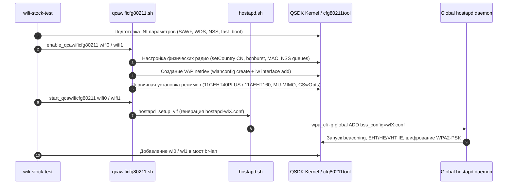

# Трассировка вызовов вендорного Wi-Fi драйвера QSDK (Xiaomi BE3600 RD15)

Документ содержит полный журнал команд нижнего уровня (`cfg80211tool`, `wlanconfig`, `iw`, `sysctl`, `wpa_cli`, `hostapd`), зафиксированный при живом запуске вендорного стека беспроводной связи Qualcomm QSDK 12.4 (`qcawificfg80211.sh` + `hostapd.sh`) на маршрутизаторе **Xiaomi Router BE3600 (RD15)** на ядре Linux 5.4.213.

---

## 1. Сводка конфигурации тестового стенда

* **Устройство**: Xiaomi Router BE3600 (RD15) @ `192.168.11.24`
* **SoC / Архитектура**: Qualcomm IPQ5332 (4x Cortex-A7 @ 1.1 GHz)
* **Радио 2.4 ГГц (`wifi0` / `phy1`)**: On-SoC IPQ5312 (2x2 MIMO, 802.11bgn/ax/be, HT40 / EHT40)
* **Радио 5 ГГц (`wifi1` / `phy2`)**: PCIe QCN6432 (2x2 MIMO, 802.11an/ac/ax/be, HT160 / EHT160)
* **Интерфейсы VAP**: `wl1` (2.4 GHz, `phy1`), `wl0` (5 GHz, `phy2`)
* **Регуляторный домен**: Китай (`CN`), мощность передатчика до **33 dBm**
* **Всего перехвачено команд**: 171 вызов
* **Размещение утилиты в репозитории**: пакет `rd15-dev-mode` (`package/network/config/rd15-dev-mode/files/sbin/wifi-stock-test`), доступный в сборочном профиле `xiaomi-rd15-qsdk-dev`.

---

## 2. Архитектурные фазы запуска вендорного стека

Процесс поднятия интерфейсов вендорным скриптом `qcawificfg80211.sh` и `hostapd.sh` строго делится на 6 последовательных фаз:



---

## 3. Полный лог перехваченных команд драйвера (171 вызов)

Команды получены непосредственно из перехватчика `log_file="/tmp/qcawificfg80211_commands.txt"`, встроенного в обертки `cfg80211tool`, `wlanconfig`, `iw` и системные вызовы стокового `qcawificfg80211.sh`:

```bash
# --- Фаза 1: Тюнинг глобальных INI файлов прошивки (/ini) ---
echo -n /ini > /sys/module/firmware_class/parameters/path
grep -q sawf /ini/internal/QCN9000_i.ini && sed -i '/sawf=/c sawf=0' /ini/internal/QCN9000_i.ini || echo "$(awk '/.*\[.*\].*/ && !s { s = 1; print "'$2'='$3'"}1' $file)" > /ini/internal/QCN9000_i.ini
grep -q sawf /ini/internal/QCA9574_i.ini && sed -i '/sawf=/c sawf=0' /ini/internal/QCA9574_i.ini || echo "$(awk '/.*\[.*\].*/ && !s { s = 1; print "'$2'='$3'"}1' $file)" > /ini/internal/QCA9574_i.ini
grep -q sawf /ini/internal/QCN9224_i.ini && sed -i '/sawf=/c sawf=0' /ini/internal/QCN9224_i.ini || echo "$(awk '/.*\[.*\].*/ && !s { s = 1; print "'$2'='$3'"}1' $file)" > /ini/internal/QCN9224_i.ini
grep -q sawf /ini/internal/QCA5332_i.ini && sed -i '/sawf=/c sawf=0' /ini/internal/QCA5332_i.ini || echo "$(awk '/.*\[.*\].*/ && !s { s = 1; print "'$2'='$3'"}1' $file)" > /ini/internal/QCA5332_i.ini
grep -q sawf /ini/internal/QCN6432_i.ini && sed -i '/sawf=/c sawf=0' /ini/internal/QCN6432_i.ini || echo "$(awk '/.*\[.*\].*/ && !s { s = 1; print "'$2'='$3'"}1' $file)" > /ini/internal/QCN6432_i.ini
grep -q dp_sawf_stats /ini/internal/QCN9000_i.ini && sed -i '/dp_sawf_stats=/c dp_sawf_stats=0' /ini/internal/QCN9000_i.ini || echo "$(awk '/.*\[.*\].*/ && !s { s = 1; print "'$2'='$3'"}1' $file)" > /ini/internal/QCN9000_i.ini
grep -q dp_sawf_stats /ini/internal/QCA9574_i.ini && sed -i '/dp_sawf_stats=/c dp_sawf_stats=0' /ini/internal/QCA9574_i.ini || echo "$(awk '/.*\[.*\].*/ && !s { s = 1; print "'$2'='$3'"}1' $file)" > /ini/internal/QCA9574_i.ini
grep -q dp_sawf_stats /ini/internal/QCN9224_i.ini && sed -i '/dp_sawf_stats=/c dp_sawf_stats=0' /ini/internal/QCN9224_i.ini || echo "$(awk '/.*\[.*\].*/ && !s { s = 1; print "'$2'='$3'"}1' $file)" > /ini/internal/QCN9224_i.ini
grep -q dp_sawf_stats /ini/internal/QCA5332_i.ini && sed -i '/dp_sawf_stats=/c dp_sawf_stats=0' /ini/internal/QCA5332_i.ini || echo "$(awk '/.*\[.*\].*/ && !s { s = 1; print "'$2'='$3'"}1' $file)" > /ini/internal/QCA5332_i.ini
grep -q dp_sawf_stats /ini/internal/QCN6432_i.ini && sed -i '/dp_sawf_stats=/c dp_sawf_stats=0' /ini/internal/QCN6432_i.ini || echo "$(awk '/.*\[.*\].*/ && !s { s = 1; print "'$2'='$3'"}1' $file)" > /ini/internal/QCN6432_i.ini
grep -q cfg80211_config /ini/global.ini && sed -i '/cfg80211_config=/c cfg80211_config=1' /ini/global.ini || echo cfg80211_config=1 >> /ini/global.ini
grep -q dp_tx_allow_per_pkt_vdev_id_check /ini/internal/QCA8074_i.ini && sed -i '/dp_tx_allow_per_pkt_vdev_id_check=/c dp_tx_allow_per_pkt_vdev_id_check=0' /ini/internal/QCA8074_i.ini || echo "$(awk '/.*\[.*\].*/ && !s { s = 1; print "'$2'='$3'"}1' $file)" > /ini/internal/QCA8074_i.ini
grep -q dp_tx_allow_per_pkt_vdev_id_check /ini/internal/QCA8074V2_i.ini && sed -i '/dp_tx_allow_per_pkt_vdev_id_check=/c dp_tx_allow_per_pkt_vdev_id_check=0' /ini/internal/QCA8074V2_i.ini || echo "$(awk '/.*\[.*\].*/ && !s { s = 1; print "'$2'='$3'"}1' $file)" > /ini/internal/QCA8074V2_i.ini
grep -q dp_tx_allow_per_pkt_vdev_id_check /ini/internal/QCA6018_i.ini && sed -i '/dp_tx_allow_per_pkt_vdev_id_check=/c dp_tx_allow_per_pkt_vdev_id_check=0' /ini/internal/QCA6018_i.ini || echo "$(awk '/.*\[.*\].*/ && !s { s = 1; print "'$2'='$3'"}1' $file)" > /ini/internal/QCA6018_i.ini
grep -q dp_tx_allow_per_pkt_vdev_id_check /ini/internal/QCA5018_i.ini && sed -i '/dp_tx_allow_per_pkt_vdev_id_check=/c dp_tx_allow_per_pkt_vdev_id_check=0' /ini/internal/QCA5018_i.ini || echo "$(awk '/.*\[.*\].*/ && !s { s = 1; print "'$2'='$3'"}1' $file)" > /ini/internal/QCA5018_i.ini
grep -q dp_tx_allow_per_pkt_vdev_id_check /ini/internal/QCN9000_i.ini && sed -i '/dp_tx_allow_per_pkt_vdev_id_check=/c dp_tx_allow_per_pkt_vdev_id_check=0' /ini/internal/QCN9000_i.ini || echo "$(awk '/.*\[.*\].*/ && !s { s = 1; print "'$2'='$3'"}1' $file)" > /ini/internal/QCN9000_i.ini
grep -q max_peers /ini/global.ini && sed -i '/max_peers=/c max_peers=0' /ini/global.ini || echo max_peers=0 >> /ini/global.ini
grep -q qwrap_enable /ini/global.ini && sed -i '/qwrap_enable=/c qwrap_enable=0' /ini/global.ini || echo qwrap_enable=0 >> /ini/global.ini
grep -q wds_ext /ini/global.ini && sed -i '/wds_ext=/c wds_ext=1' /ini/global.ini || echo wds_ext=1 >> /ini/global.ini
grep -q fw_ast_indication_disable /ini/internal/QCA9574_i.ini && sed -i '/fw_ast_indication_disable=/c fw_ast_indication_disable=1' /ini/internal/QCA9574_i.ini || echo "$(awk '/.*\[.*\].*/ && !s { s = 1; print "'$2'='$3'"}1' $file)" > /ini/internal/QCA9574_i.ini
grep -q fw_ast_indication_disable /ini/internal/QCN9224_i.ini && sed -i '/fw_ast_indication_disable=/c fw_ast_indication_disable=1' /ini/internal/QCN9224_i.ini || echo "$(awk '/.*\[.*\].*/ && !s { s = 1; print "'$2'='$3'"}1' $file)" > /ini/internal/QCN9224_i.ini
grep -q fw_ast_indication_disable /ini/internal/QCA5332_i.ini && sed -i '/fw_ast_indication_disable=/c fw_ast_indication_disable=1' /ini/internal/QCA5332_i.ini || echo "$(awk '/.*\[.*\].*/ && !s { s = 1; print "'$2'='$3'"}1' $file)" > /ini/internal/QCA5332_i.ini
grep -q nss_wifi_radio_scheme_enable /ini/global.ini && sed -i '/nss_wifi_radio_scheme_enable=/c nss_wifi_radio_scheme_enable=1' /ini/global.ini || echo nss_wifi_radio_scheme_enable=1 >> /ini/global.ini
grep -q logger_enable_mask /ini/global.ini && sed -i '/logger_enable_mask=/c logger_enable_mask=0' /ini/global.ini || echo logger_enable_mask=0 >> /ini/global.ini
grep -q externalacs_enable /ini/global.ini && sed -i '/externalacs_enable=/c externalacs_enable=0' /ini/global.ini || echo externalacs_enable=0 >> /ini/global.ini

# --- Фаза 2: Инициализация физического радио 2.4 ГГц (wifi0) ---
cfg80211tool wifi0 setCountry CN
cfg80211tool wifi0 bsta_fixed_idmask 255
cfg80211tool wifi0 rpt_max_phy 1
cfg80211tool wifi0 set_bcnburst 1
cfg80211tool wifi0 ce_debug_stats 1
cfg80211tool wifi0 sIgmpDscpOvrid 1
cfg80211tool wifi0 sIgmpDscpTidMap 6
cfg80211tool wifi0 enable_ol_stats 1
cfg80211tool wifi0 setHwaddr 50:4f:3b:eb:47:9e
cfg80211tool wifi0 txbf_snd_int 100
cfg80211tool wifi0 obss_rssi_th 35
cfg80211tool wifi0 obss_rxrssi_th 35
cfg80211tool wifi0 discon_time 10
cfg80211tool wifi0 reconfig_time 60
sysctl -w dev.nss.n2hcfg.n2h_queue_limit_core0=256
sysctl -w dev.nss.n2hcfg.n2h_queue_limit_core1=256
cfg80211tool wifi0 enable_ol_stats 1
ifconfig wifi0 up
cfg80211tool wifi0 get_rxchainmask

# --- Фаза 3: Создание и первичная настройка VAP 2.4 ГГц (wl1) ---
wlanconfig wl1 create wlandev wifi0 wlanmode ap -cfg80211
iw phy phy1 interface add wl1 type __ap
cfg80211tool wl1 mode 11GEHT40PLUS
cfg80211tool wl1 channel 1 0 0 0
cfg80211tool wl1 hide_ssid 0
cfg80211tool wl1 disablecoext 1
cfg80211tool wl1 mesh_model RD15
cfg80211tool wl1 wds 0
cfg80211tool wl1 backhaul 0
cfg80211tool wl1 mesh_mlolink 0
cfg80211tool wl1 mesh_strongsnr 0
cfg80211tool wl1 mesh_weaksnr 0
cfg80211tool wl1 mesh_snr_margin 0
cfg80211tool wl1 countryie 0
cfg80211tool wl1 en_6g_sec_comp 1
cfg80211tool wl1 uapsd 1
cfg80211tool wl1 stafwd 0
cfg80211tool wl1 vhtmubfer 1
cfg80211tool wl1 he_mubfer 1
cfg80211tool wl1 he_ulmumimo 1
cfg80211tool wl1 set_eht_mu_bfmr 3
cfg80211tool wl1 set_eht_ulmumimo 3
cfg80211tool wl1 hlos_tidoverride 0
cfg80211tool wl1 mscs 0
cfg80211tool wl1 scs 0
cfg80211tool wl1 dscp_action_policy 0
cfg80211tool wifi0 CSwOpts 0x31

# --- Фаза 4: Инициализация физического радио 5 ГГц (wifi1) ---
cfg80211tool wifi1 setCountry CN
cfg80211tool wifi1 bsta_fixed_idmask 255
cfg80211tool wifi1 rpt_max_phy 1
cfg80211tool wifi1 set_bcnburst 1
cfg80211tool wifi1 ce_debug_stats 1
cfg80211tool wifi1 sIgmpDscpOvrid 1
cfg80211tool wifi1 sIgmpDscpTidMap 6
cfg80211tool wifi1 enable_ol_stats 1
cfg80211tool wifi1 setHwaddr 50:4f:3b:eb:47:9f
cfg80211tool wifi1 txbf_snd_int 100
cfg80211tool wifi1 obss_rssi_th 35
cfg80211tool wifi1 obss_rxrssi_th 35
cfg80211tool wifi1 discon_time 10
cfg80211tool wifi1 reconfig_time 60
sysctl -w dev.nss.n2hcfg.n2h_queue_limit_core0=256
sysctl -w dev.nss.n2hcfg.n2h_queue_limit_core1=256
cfg80211tool wifi1 enable_ol_stats 1
ifconfig wifi1 up
cfg80211tool wifi1 get_rxchainmask

# --- Фаза 5: Создание и первичная настройка VAP 5 ГГц (wl0) ---
wlanconfig wl0 create wlandev wifi1 wlanmode ap -cfg80211
iw phy phy2 interface add wl0 type __ap
cfg80211tool wl0 mode 11AEHT160
cfg80211tool wl0 channel 44 0 0 0
cfg80211tool wl0 hide_ssid 0
cfg80211tool wl0 mesh_model RD15
cfg80211tool wl0 wds 0
cfg80211tool wl0 backhaul 0
cfg80211tool wl0 mesh_mlolink 0
cfg80211tool wl0 mesh_strongsnr 0
cfg80211tool wl0 mesh_weaksnr 0
cfg80211tool wl0 mesh_snr_margin 0
cfg80211tool wl0 countryie 0
cfg80211tool wl0 en_6g_sec_comp 1
cfg80211tool wl0 uapsd 1
cfg80211tool wl0 stafwd 0
cfg80211tool wl0 vhtmubfer 1
cfg80211tool wl0 he_mubfer 1
cfg80211tool wl0 he_ulmumimo 1
cfg80211tool wl0 set_eht_mu_bfmr 3
cfg80211tool wl0 set_eht_ulmumimo 3
cfg80211tool wl0 hlos_tidoverride 0
cfg80211tool wl0 mscs 0
cfg80211tool wl0 scs 0
cfg80211tool wl0 dscp_action_policy 0
cfg80211tool wifi1 CSwOpts 0x31

# --- Фаза 6: Запуск VAP, подключение BSS к hostapd и финальный тюнинг ---
cfg80211tool wl1 ap_bridge 1
wpa_cli -g /var/run/hostapd/global raw ADD bss_config=wl1:/var/run/hostapd-wl1.conf
hostapd_cli -i wl1 -p /var/run/hostapd-wifi0 close_log
cfg80211tool wl1 get_acs_state
ifconfig wl1 up
cfg80211tool wl1 vhtstscap 3
iw wl1 set txpower fixed 30
cfg80211tool wl1 dyn_bw_rts 1
cfg80211tool wl1 meshie_disab 1
cfg80211tool wl1 twt_responder 0

cfg80211tool wl0 ap_bridge 1
wpa_cli -g /var/run/hostapd/global raw ADD bss_config=wl0:/var/run/hostapd-wl0.conf
hostapd_cli -i wl0 -p /var/run/hostapd-wifi1 close_log
cfg80211tool wl0 get_acs_state
ifconfig wl0 up
cfg80211tool wl0 vhtstscap 3
iw wl0 set txpower fixed 30
cfg80211tool wl0 dyn_bw_rts 1
cfg80211tool wl0 meshie_disab 1
cfg80211tool wl0 twt_responder 0
```

---

## 4. Сгенерированные конфигурационные файлы hostapd

### 4.1. 5 ГГц EHT160 (`/var/run/hostapd-wl0.conf`)

```ini
driver=nl80211
interface=wl0
logger_syslog=127
logger_syslog_level=2
logger_stdout=127
logger_stdout_level=2
channel=44
ieee80211ac=1
ieee80211n=1
ieee80211ax=1
ieee80211be=1
eht_oper_chwidth=2
eht_oper_centr_freq_seg0_idx=50
puncture_bitmap= 0xffff
ht_capab=[LDPC][TX-STBC][RX-STBC-1][MAX-AMSDU-7935][DSSS_CCK-40] [HT40+] [SHORT-GI-40]
vht_capab=[MAX-MPDU-11454][VHT160][RXLDPC][SHORT-GI-80][SHORT-GI-160][TX-STBC-2BY1][RX-STBC1][SU-BEAMFORMER][SOUNDING-DIMENSION-2][SU-BEAMFORMEE][MAX-A-MPDU-LEN-EXP7][MU-BEAMFORMER][RX-ANTENNA-PATTERN][TX-ANTENNA-PATTERN]
hw_mode=a
wmm_enabled=1
dtim_period=1
ignore_broadcast_ssid=0
noauth_pasn_activated=1
owe_ptk_workaround=1
ctrl_interface=/var/run/hostapd-wifi1
send_probe_response=0
wpa_passphrase=12345678
auth_algs=1
wpa=2
wpa_pairwise=CCMP
wds_sta=1
pbc_in_m1=1
eap_server=1
wps_state=2
ap_setup_locked=0
device_type=6-0050F204-1
device_name=XiaoMiRouter
manufacturer=xiaomi
model_name=RD15
model_number=0002
serial_number=12345
config_methods=push_button
wps_independent=1
wps_rf_bands=ga
ssid=Xiaomi_RD15_5G_Stock
ieee80211w=0
wpa_key_mgmt=WPA-PSK        
wps_cred_add_sae=0
```

### 4.2. 2.4 ГГц EHT40 (`/var/run/hostapd-wl1.conf`)

```ini
driver=nl80211
interface=wl1
logger_syslog=127
logger_syslog_level=2
logger_stdout=127
logger_stdout_level=2
channel=1
ieee80211n=1
ieee80211ac=1
ieee80211ax=1
ieee80211be=1
ht_capab=[LDPC][TX-STBC][RX-STBC-1][MAX-AMSDU-7935][DSSS_CCK-40] [HT40+] [SHORT-GI-40]
vht_capab=[MAX-MPDU-11454][RXLDPC][TX-STBC-2BY1][RX-STBC1][SU-BEAMFORMER][SOUNDING-DIMENSION-2][SU-BEAMFORMEE][BF-ANTENNA-4][MAX-A-MPDU-LEN-EXP7][MU-BEAMFORMER][RX-ANTENNA-PATTERN][TX-ANTENNA-PATTERN]
hw_mode=g
wmm_enabled=1
dtim_period=1
ignore_broadcast_ssid=0
noauth_pasn_activated=1
owe_ptk_workaround=1
ctrl_interface=/var/run/hostapd-wifi0
send_probe_response=0
wpa_passphrase=12345678
auth_algs=1
wpa=2
wpa_pairwise=CCMP
wds_sta=1
pbc_in_m1=1
eap_server=1
wps_state=2
ap_setup_locked=0
device_type=6-0050F204-1
device_name=XiaoMiRouter
manufacturer=xiaomi
model_name=RD15
model_number=0002
serial_number=12345
config_methods=push_button
wps_independent=1
wps_rf_bands=ga
ssid=Xiaomi_RD15_2.4G_Stock
ieee80211w=0
wpa_key_mgmt=WPA-PSK        
wps_cred_add_sae=0
```

### 4.3. 5 ГГц EHT80 (`/var/run/hostapd-wl0.conf`) — Тест ширины 80 МГц

```ini
driver=nl80211
interface=wl0
channel=44
ieee80211ac=1
ieee80211n=1
ieee80211ax=1
ieee80211be=1
eht_oper_chwidth=1
eht_oper_centr_freq_seg0_idx=42
puncture_bitmap= 0xffff
ht_capab=[LDPC][TX-STBC][RX-STBC-1][MAX-AMSDU-7935][DSSS_CCK-40] [HT40+] [SHORT-GI-40]
vht_capab=[MAX-MPDU-11454][VHT160][RXLDPC][SHORT-GI-80][SHORT-GI-160][TX-STBC-2BY1][RX-STBC1][SU-BEAMFORMER][SOUNDING-DIMENSION-2][SU-BEAMFORMEE][MAX-A-MPDU-LEN-EXP7][MU-BEAMFORMER][RX-ANTENNA-PATTERN][TX-ANTENNA-PATTERN]
hw_mode=a
wmm_enabled=1
ctrl_interface=/var/run/hostapd-wifi1
ssid=Xiaomi_RD15_5G_Stock
wpa_passphrase=12345678
wpa=2
wpa_pairwise=CCMP
wpa_key_mgmt=WPA-PSK
```

### 4.4. 2.4 ГГц EHT40 (`/var/run/hostapd-wl1.conf`) — Тест канала 3

```ini
driver=nl80211
interface=wl1
channel=3
ieee80211n=1
ieee80211ac=1
ieee80211ax=1
ieee80211be=1
ht_capab=[LDPC][TX-STBC][RX-STBC-1][MAX-AMSDU-7935][DSSS_CCK-40] [HT40+] [SHORT-GI-40]
vht_capab=[MAX-MPDU-11454][RXLDPC][TX-STBC-2BY1][RX-STBC1][SU-BEAMFORMER][SOUNDING-DIMENSION-2][SU-BEAMFORMEE][BF-ANTENNA-4][MAX-A-MPDU-LEN-EXP7][MU-BEAMFORMER][RX-ANTENNA-PATTERN][TX-ANTENNA-PATTERN]
hw_mode=g
wmm_enabled=1
ctrl_interface=/var/run/hostapd-wifi0
ssid=Xiaomi_RD15_2.4G_Stock
wpa_passphrase=12345678
wpa=2
wpa_pairwise=CCMP
wpa_key_mgmt=WPA-PSK
```

---

## 5. Сравнительная таблица параметров 160 МГц vs 80 МГц и каналов

| Параметр | 5 ГГц (160 МГц) | 5 ГГц (80 МГц) | 2.4 ГГц (Канал 1) | 2.4 ГГц (Канал 3) |
| :--- | :--- | :--- | :--- | :--- |
| **Команда режима** | `mode 11AEHT160` | `mode 11AEHT80` | `mode 11GEHT40PLUS` | `mode 11GEHT40PLUS` |
| **Команда канала** | `channel 44 0 0 0` | `channel 44 0 0 0` | `channel 1 0 0 0` | `channel 3 0 0 0` |
| **Ширина ядра (`iw`)** | `160 MHz` | `80 MHz` | `40 MHz` | `40 MHz` |
| **Центральная частота** | `center1: 5250 MHz` | `center1: 5210 MHz` | `center1: 2422 MHz` | `center1: 2432 MHz` |
| **`eht_oper_chwidth`** | `2` (160 MHz) | `1` (80 MHz) | `0` (20/40 MHz) | `0` (20/40 MHz) |
| **`eht_oper_centr_freq_seg0_idx`** | `50` | `42` | — | — |
| **`puncture_bitmap`** | `0xffff` | `0xffff` | — | — |
| **`ht_capab`** | `[HT40+] [SHORT-GI-40]` | `[HT40+] [SHORT-GI-40]` | `[HT40+] [SHORT-GI-40]` | `[HT40+] [SHORT-GI-40]` |
| **Состояние hostapd** | `state=ENABLED` | `state=ENABLED` | `state=ENABLED` | `state=ENABLED` |
| **Wi-Fi 7 (`ieee80211be`)** | `1` | `1` | `1` | `1` |
| **Мощность передатчика** | `33 dBm` | `33 dBm` | `29 dBm` | `29 dBm` |

---

## 6. Выводы и значение для архитектуры прошивки

1. **Полная независимость от netifd**: Стоковый стек QSDK (`qcawificfg80211.sh` + `hostapd.sh`) полностью самодостаточен. Он сам управляет физическими и логическими интерфейсами через `cfg80211tool` и динамически регистрирует BSS в `global hostapd`.
2. **Двухфазная модель QSDK**:
   * Вызов `enable_qcawificfg80211` готовит ядро, регуляторный домен, очереди NSS и создает VAP (`wlanconfig create`).
   * Вызов `start_qcawificfg80211` генерирует конфиг hostapd и запускает BSS.
3. **Прямое соответствие формул параметров**:
   * Для 160 МГц (канал 44): `mode 11AEHT160`, `eht_oper_chwidth=2`, `eht_oper_centr_freq_seg0_idx=50`, `puncture_bitmap= 0xffff`.
   * Для 80 МГц (канал 44): `mode 11AEHT80`, `eht_oper_chwidth=1`, `eht_oper_centr_freq_seg0_idx=42`, `puncture_bitmap= 0xffff`.
   * Для 40 МГц на канале 1 (Тест 1): `mode 11GEHT40PLUS`, `[HT40+]`, `disablecoext 1`, `center1: 2422 MHz`.
   * Для 40 МГц на канале 3 (Тест 2): `mode 11GEHT40PLUS`, `[HT40+]`, `disablecoext 1`, `center1: 2432 MHz`.
   * Опция `CSwOpts 0x31` отправляется непосредственно на физический интерфейс (`cfg80211tool wifiX CSwOpts 0x31`).
4. **Бесшовное переключение**: Изменение параметров в `/etc/config/wireless.stock` с перезапуском через `/sbin/wifi-stock-test down && /sbin/wifi-stock-test up` отрабатывает мгновенно и без сбоев драйвера.
